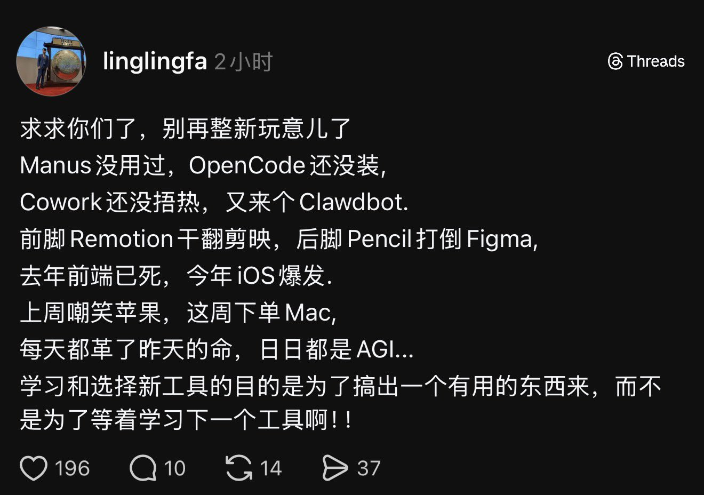

# 研究ing

先从社区showcase入手

看了一些讲解视频，比较以往的自动个人助手来说，就是原生可以接入社交APP，聊天式下发命令获取结果，配合MAC低功耗7\*24小时运行

- 🔗[你被Clawdbot刷屏了吗，FOMO了吗？](https://www.bilibili.com/video/BV1fbzvBoEwW/?share_source=copy_web&vd_source=5f5352239ee1344ae20e066b19048d68)

学到了一个新词FOMO：Fear Of Missing Out，害怕错过机会的焦虑情绪

下面是看到的一张梗图，确实应该避免狂热的工具学习，思考什么是真实需求：

不过话又说回来对于7\*24重复劳动的场景也许是杀手级应用。还是先研究研究showcase再说吧...........
