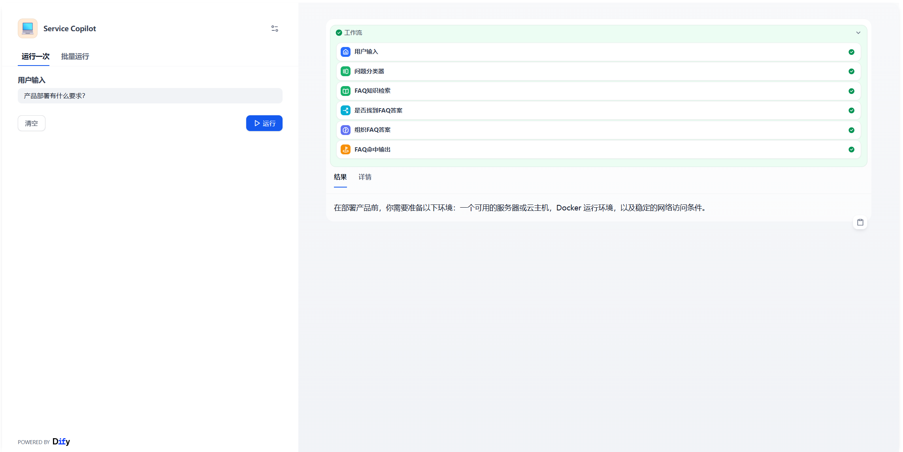
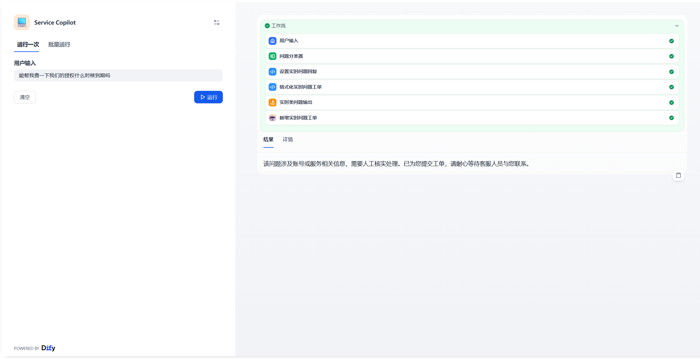
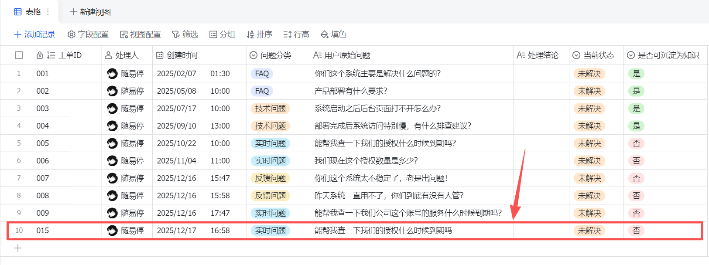

# 💁‍♀️基于Dify workflow的智能客服

看到AI之后很容易想到的落地场景之一就是客服，当然这里面也有一些挑战，而且也不是所有客服都推荐上AI的，下面我用一个软件类客服的例子来展示一下AI赋能的可能性

起初我采用了Dify+n8n的方式来做，主要目的是为了验证一把这两个主流平台能不能一块搭伙做事，但是做着做着就发现其实没太必要，然后我又重构到Dify平台上来，完全由Dify workflow来做

再结合飞书多维表格及飞书生态的能力达到完整的效果，多维表格可以管理工单闭环流程、总结FAQ、仪表盘展示等

## 📚项目简介

从用户角度分析：在软件、系统、硬件部署使用的时候我们通常会遇到一些问题，不理解产品某项功能，不清楚某个报错的含义，对于定制化开发状态想要实时了解

从软件供应商角度分析：供应商在拿到用户问题之后，之前的客服系统是在做关键词的匹配，稍微说的不准就回答不上，另外对于客服人力的管理没有量化标准，客服队伍较小则不足以满足咨询需求，客服队伍过大又会造成人力成本的压力

所以对于这两个角度都有着不同的痛点，当然也不止这些，对于不同行业的客服场景都会有很多难题而AI在语义理解方面的优势恰好能优化以往硬编码枚举的回答方式，而且由RAG加持的知识库系统也能够有效的精准的匹配到用户的问题，并且对于人力的节省也是非常可观的

当然这并不代表着AI客服对于真人客服的完全取代，而是将客服场景的业务逻辑重新调整，发挥最大的效率和价值

## 💻项目内容


**workflow架构流程分析**

- 首先做四类问题的分类：
    - A：FAQ问题：用户咨询产品功能、适用场景、部署方式、系统能力边界、使用方式等通用问题，不涉及具体客户数据、订单状态、故障报错或投诉情绪。
    - B：技术问题：用户在系统使用、部署、运行过程中遇到问题或异常，包括安装失败、功能异常、性能问题、报错、无法访问等，通常希望获得排查思路或解决方法。
    - C：实时问题：用户咨询与账号、订单、服务有效期、合同、授权、保修等相关的信息，通常需要查询具体客户数据，无法由 AI 自动判断。
    - D：反馈问题：用户带有明显不满、投诉或情绪化表达，涉及服务质量、责任判断或需要人工介入处理的情况。
- 如果是A先去知识库找答案，如果有答案那么通过LLM节点组织回复将答案返回给用户；如果没有答案则在工单多维表格中新增一条数据，并且给用户返回一条符合语境的答复。
- 如果是B也是先去知识库寻找答案，如果有则LLM节点组织答案返回用户；如果没有则在工单多维表格中新增一条数据，并且给用户返回一条符合语境的答复。
- 如果是C则直接在工单多维表格中新增一条数据，并且给用户返回一句符合语境的答复。
- 如果是D也直接在工单多维表格中新增一条数据，并且给用户返回一句符合语境的答复。


**飞书多维表格介绍**

表格主要用来维护处理的工单，表格记录工单状态并且让工单流程在飞书多维表格中进行流转最终闭环

在多维表格上可提醒人工客服的接入、记录业务人员的回复、推进客户回访

在处理完工单之后可以利用飞书多维表格的AI能力将更常用的问题组织起来然后根据工单类型定期更新到对应的知识库中

最后可以利用多维表格自带的开箱即用的仪表盘功能进行数据总览显示

## 🎇结果展示
**知识库中有FAQ问题的回答**

**实时问题转工单转人工**



## 🚀项目优化与迭代方向

### 优化项

目前的系统其实还只是一个Demo而不是生产的Production，想要更进一步还需要做些优化和填充

#### workflow部分
1. 分类器需要「不确定态」和二次确认机制

现在是：用户问题->分类器->A/B/C/D

但是在真实环境中可能是混合问题：
- 技术问题 + 投诉混合
- 账号问题 + 抱怨情绪
- FAQ + 实际异常

可以增加一个“灰色分类策略”，对非单一问题进行拆解，用多层的回答来处理混合问题

2. 技术问题建议引导客户「补充信息」，而不是回答不出来直接转工单

可以追加提问，例如：
```markdown
请您补充以下信息以便更快排查：
- 使用的产品版本
- 部署方式（本地 / 云）
- 报错信息或截图
```

因为在前期尽可能多的了解客户问题发生的背景有利于问题的高效处理

#### 多维表格部分

1. 工单状态需要增加

多维表格积累的数据也是后面反哺优化智能客服的重要来源，所以适当增加工单状态有利于数据分析和检验AI客服的效果

- 待处理（AI 创建）
- 已接手（人工已读）
- 处理中
- 已解决
- 已关闭

2. 可以用自动化的方式代替人工决定是否沉淀为FAQ

可以做一个自动化的流程让被处理的问题如果符合FAQ的条件那么就自动将其沉淀到知识库中，人工只需要确认

#### 知识库部分

现在的架构其实可以横向复用，走向不同行业。但就需要有不同行业的企业自己的数据和知识积累做支撑，干净且可用的数据在AI提效的过程中可太重要了，所以从现在开始即使不知道要拿AI来干啥可以先把数据积累起来
