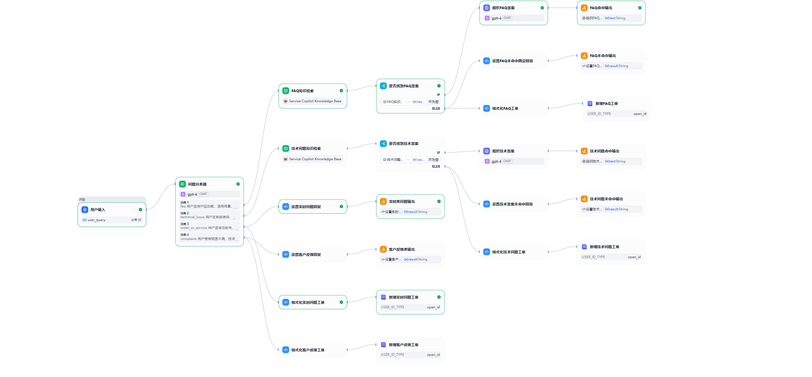
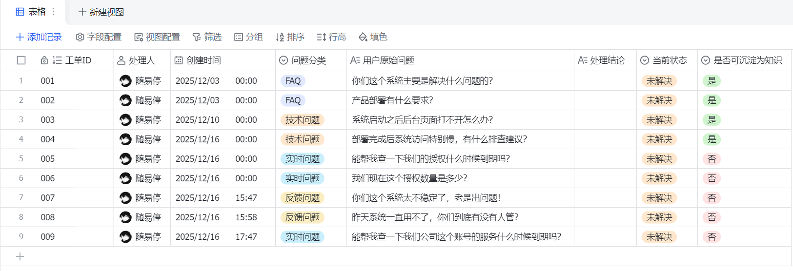

# Service Copilot：AI Agent 在客服场景的落地实践

客服无疑是很多人拿到AI之后很容易想到的场景，当然这里面也有一些挑战，而且也不是所有客服都推荐上AI的，下面我用一个软件客服的例子来展示一下AI赋能的可能性

起初我才用了Dify+n8n的方式来做，主要目的是为了验证一把这两个主流平台能不能一块搭伙做事，但是做着做着就发现其实没太必要，最后我又重构到Dify平台上来，完全由Dify workflow来做

然后再结合飞书多维表格及飞书生态的能力达到完整的效果

## 项目简介

从用户角度分析：在软件、系统、硬件部署使用的时候我们通常会遇到一些问题，不理解产品某项功能，不清楚某个报错的含义，对于订单信息和产品报修物流状态想要实时了解

从供应商角度分析：供应商在拿到用户问题之后，之前的客服系统是在做关键词的匹配，稍微说的不准就回答不上，即使已经准备好了回答的FAQ语料，另外对于客服人力的管理没有量化标准，客服队伍较小则不足以满足咨询需求，客服队伍过大又会造成人力成本的压力

所以对于这两个角度都有着不同的痛点，而AI在语义理解方面的优势恰好能优化以往硬编码枚举的回答方式，而且由RAG加持的知识库系统也能够有效的精准的匹配到用户的问题，并且对于人力的节省也是非常可观的

当然这并不代表着AI客服对于真人客服的完全取代，而是将客服场景的业务逻辑重新调整，发挥最大的效率和价值

## 项目内容

{/*  */}
**workflow架构流程分析**

开始
 ↓
用户输入（user_query）
 ↓
问题分类器（A / B / C / D）
 ↓
├─ A：FAQ
│   └─ 知识库检索（FAQ KB）
│       ├─ 命中 → LLM（基于 KB 回答）
│       └─ 未命中 → 新增工单 → 固定回复
│
├─ B：技术问题
│   └─ 知识库检索（技术 KB）
│       ├─ 命中 → LLM（基于 KB 回答）
│       └─ 未命中 → 新增工单 → 固定回复
│
├─ C：账号 / 订单
│   └─ 新增工单 → 固定回复
│
└─ D：投诉 / 情绪
    └─ 新增工单 → 安抚型回复

- 首先做四类问题的分类：
    A. FAQ用户咨询产品功能、适用场景、部署方式、系统能力边界、使用方式等通用问题，不涉及具体客户数据、订单状态、故障报错或投诉情绪。
    B. 用户在系统使用、部署、运行过程中遇到问题或异常，包括安装失败、功能异常、性能问题、报错、无法访问等，通常希望获得排查思路或解决方法。
    C. 用户咨询与账号、订单、服务有效期、合同、授权、保修等相关的信息，通常需要查询具体客户数据，无法由 AI 自动判断。
    D. 用户带有明显不满、投诉或情绪化表达，涉及服务质量、责任判断或需要人工介入处理的情况。
- 如果是A先去知识库找答案，如果知识库有答案那么通过LLM节点组织答案将答案返回给用户；如果没有答案则在工单多维表格中新增一条数据，并且给用户返回一条稳定的答复。
- 如果是B也是先去知识库寻找答案，如果有则LLM节点组织答案返回用户；如果没有则在工单多维表格中新增一条数据，并且给用户返回一条符合语境的答复。
- 如果是C则直接在工单多维表格中新增一条数据，并且给用户返回一句符合语境的答复。
- 如果是D也直接在工单多维表格中新增一条数据，并且给用户返回一句符合语境的答复。

{/*  */}
**飞书多维表格**
表格主要用来维护处理的工单，表格记录工单状态并且让工单流程在飞书多维表格中进行流转最终闭环
在多维表格上设置消息提醒进行人工客服的接入、业务人员的回复、客户回访
在处理完工单之后可以利用飞书多维表格的AI能力将更常用的问题组织起来然后根据工单类型的分类加到对应的知识库中

最后可以利用多维表格自带的开箱即用的仪表盘功能进行数据总览显示

## 项目结果

问题列表
| 编号 | 用户问题示例 | 预期分类 | 预期系统行为 | 是否应创建工单 |
|----|----|----|----|----|
| A-1 | 你们这个系统主要是解决什么问题的？ | FAQ | 命中 FAQ 知识库，LLM 组织答案并直接回复 | 否 |
| B-1 | 系统启动之后后台页面打不开怎么办？ | 技术问题 | 命中技术知识库，返回排查思路 | 否 |
| B-2 | 部署完成后系统访问特别慢，有什么排查建议？ | 技术问题 | 可能未完全命中，创建技术工单，返回技术兜底回复 | 是 |
| C-1 | 能帮我查一下我们公司这个账号的服务什么时候到期吗？ | 账号/订单 | 不走知识库，直接创建工单并返回人工处理回复 | 是 |
| C-2 | 我们现在这个授权数量是多少？ | 账号/订单 | 直接建工单，提示需要人工核实 | 是 |
| D-1 | 你们这个系统太不稳定了，老是出问题！ | 投诉 | 直接创建投诉工单，返回安抚型回复 | 是 |
| D-2 | 昨天系统一直用不了，你们到底有没有人管？ | 投诉 | 创建投诉工单，安抚并说明人工跟进 | 是 |
