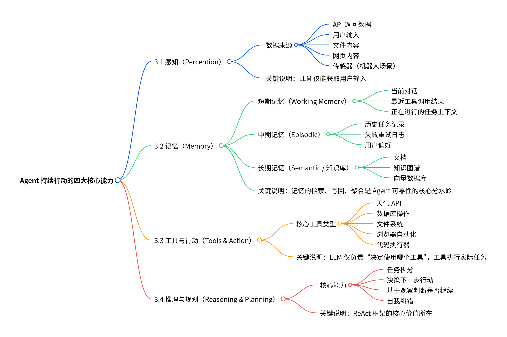
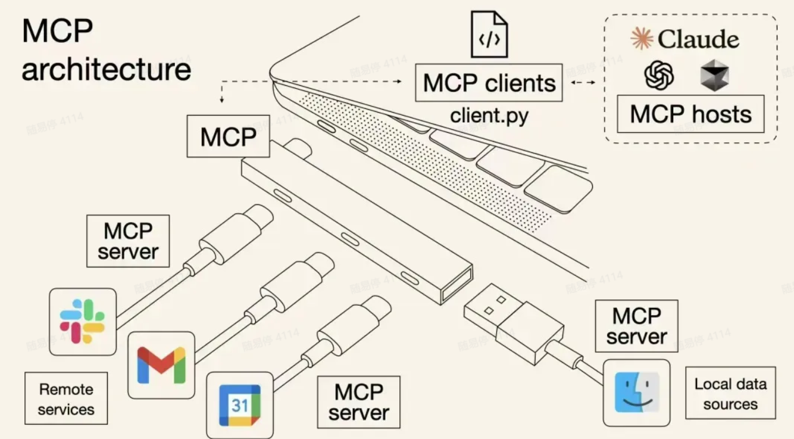

### 贯穿全文的🌰

> 不用害怕看不懂，最后会逐步讲解
>
> 这个图片贯穿全文，可以再开一个标签页分屏显示图片，边阅读正文边理解图片


## 💡 导语：LLM 与 Agent 的本质区别

Agent 不是 LLM 的替代品，而是它的 **进化形态**。

### 1. LLM：语言与推理引擎（会说，不会做）

LLM（大语言模型）能生成文本、推理问题、理解意图、输出结构化内容（如 JSON / Schema），甚至生成 SQL/代码。但它不能执行真实动作（写文件、下单、API 调用）、不能与系统交互、不能保存长期记忆、不能控制状态机，也无法稳定完成多轮复杂任务。

- LLM 的本质是一个超级语言补全器 + 世界模型。
- **示例：** 当用户要求“帮我订一个明天飞上海的机票，预算 500 元以内”时，LLM 只会根据训练数据“猜测机票价格”给你几段建议，但不会去查真实航班。本质上，它是在 **说** ，不是在 **做**。

### 2. Agent：让 LLM 变成“能行动的智能体”（会做）

Agent 是让 LLM 的“推理能力”在系统中运作起来的框架。Agent 必须具备完整闭环：感知 $\rightarrow$ 记忆 $\rightarrow$ 推理 $\rightarrow$ 工具调用 $\rightarrow$ 执行动作 $\rightarrow$ 观察结果 $\rightarrow$ 再推理 $\rightarrow$ 完成任务。

- **Agent 的核心价值：完成任务，而不是回复**。
- **示例：** Agent 会识别意图 $\rightarrow$ 调用真实 API 查询航班 $\rightarrow$ 过滤预算范围 $\rightarrow$ 生成可购买方案。最终 Agent 的输出是找到符合预算的航班方案，而不是建议。

**核心总结：** LLM 只能“说”，Agent 才能“做”。

| 类别         | LLM | Agent |
| :----------- | :-- | :---- |
| 推理         | ✔️  | ✔️    |
| 工具调用     | ❌  | ✔️    |
| 状态管理     | ❌  | ✔️    |
| 长期记忆     | ❌  | ✔️    |
| 对外行动     | ❌  | ✔️    |
| 自我修正     | ❌  | ✔️    |
| 多轮任务执行 | ❌  | ✔️    |

## 🛠️ 第二部分：Agent 的持续行动力——系统与循环

Agent 之所以能持续行动，是因为它是一套 **“带状态的推理—行动循环系统”**。

### 1. Agent 的四大核心能力

Agent 若要能“持续行动”，必须至少具备四类能力：


1.  **感知 (Perception)：** 接收环境输入。数据来源包括 API 返回数据、用户输入、文件内容等。
2.  **记忆 (Memory)：** 管理不同层级的状态和知识。长期记忆（文档、向量数据库）的检索、写入、聚合是 Agent 可靠性的核心分水岭。
3.  **工具与行动 (Tools & Action)：** LLM 仅负责 **决定** 使用哪个工具，工具负责 **执行** 实际任务。
4.  **推理与规划 (Reasoning & Planning)：** 核心能力在于任务拆分、决策下一步以及自我纠错。

### 2. Agent 的标准工作循环（案例详解）

下面是标准的 Agent 循环伪代码：

```python
while not done:
    # 1. 读取 “状态”
    context = memory.retrieve()

    # 2. 基于状态推理下一步
    thought = LLM.plan(context)

    # 3. 判断模型的意图是不是 “要执行工具”
    action = parse(thought)

    # 4. 执行工具
    result = tools.execute(action)

    # 5. 将观察写入记忆（外部长期状态）
    memory.write(action, result)

    # 6. 判断任务是否达成
    done = check_goal(result)
```

翻译成中文就是：Agent 的工作不是“一次调用模型”，而是一个循环过程。

| 步骤       | Agent 必要能力 | 作用                         |
| :--------- | :------------- | :--------------------------- |
| 读取记忆   | 状态管理       | 让模型知道“我上一轮做到哪了” |
| 推理下一步 | 规划           | 决定下一步动作               |
| 执行工具   | 行动           | 让“语言输出”变成“真实动作”   |
| 写入记忆   | 状态更新       | 保证下一轮不会遗忘           |
| 判断完成   | 收敛机制       | 避免无限循环                 |

**🧩 我们可以用一个例子理解这个步骤：自动化报销 Agent**

假设要做一个公司内部的“报销助手 Agent”，它能：

1. 解析用户上传的发票
2. 自动分类
3. 查预算
4. 创建报销单
5. 提交审批

它的每一步都严格按上面循环：

**第一轮**

- 读记忆：空
- 规划：用户上传了发票，我先 OCR
- 行动：调用 `read_invoice()`
- 写记忆：发票金额 = 320, 类别 = 交通

**第二轮**

- 读记忆：发票金额、类别
- 规划：需要查预算剩余额度
- 行动：`get_budget(user_id)`

**第三轮**

- 读记忆：预算 = 500
- 规划：可以创建报销单
- 行动：`create_ticket(320, "交通")`

**第四轮**

- 读记忆：报销单编号
- 规划：提交审批
- 行动：`submit_approval(ticket_id)`
- 达成任务 → done

**结论：** 一个 Agent 是一套 **“带状态的推理—行动循环系统”**，**循环 + 状态** 才是核心。

### 3. Agent 的设计范式

**三大 Agent 设计范式对照表**

| 属性                 | **Reactive（反应式）**                   | **Deliberative（规划式）**                                 | **ReAct（推理+行动）**                                         |
| -------------------- | ---------------------------------------- | ---------------------------------------------------------- | -------------------------------------------------------------- |
| **思维方式**         | 无规划、即时反应                         | 先思考再行动、有显式 Plan                                  | 边做边想（Thought → Action → Observation）                     |
| **主要特征**         | 不拆分任务；无多步链；输入→输出；延迟低  | 生成明确 Plan；任务拆解；逐步验证；推理深但成本高          | 有状态循环；支持自我纠错；在能力与成本间折中                   |
| **适用场景**         | 助手问答、单步命令                       | 代码调试、法律文书、多文档推理、企业自动化                 | 复杂多步骤任务、跨工具工作流、动态环境                         |
| **典型示例**         | 生成邮件草稿；总结单文档；普通聊天机器人 | GPT-o1、Anthropic Slow Thinking；自动写 PRD→生成测试→跑 CI | 旅行规划（查天气→查酒店→预订）；客服工单自动化；数据分析 Agent |
| **优缺点（一句话）** | 成本低、延迟小，但能力受限，非完整 Agent | 推理能力强、可靠但昂贵，适合高风险任务                     | 平衡速度与能力、工程化首选，适合大多数生产场景                 |

**📚 补充：其他常见 Agent 分类方式**

除了主流的“三分法”，工程实践中还有其他几种分类视角。

**🔧 按环境交互方式分类**

| 类型         | 特征               | 应用            |
| ------------ | ------------------ | --------------- |
| 单轮 Agent   | 一次输入，一次输出 | 助手问答        |
| 多轮 Agent   | 有循环、有上下文   | 工作流自动化    |
| 交互式 Agent | 持续与环境互动     | 游戏 AI、机器人 |

**🔧 按控制方式分类**

| 类型                 | 谁主导流程？           | 示例              |
| -------------------- | ---------------------- | ----------------- |
| LLM-Controlled Agent | 一切由大模型决定       | ReAct、AutoGPT    |
| Orchestrated Agent   | 程序做编排，LLM 做判断 | LangGraph         |
| Hybrid Agent         | 流程图 + 推理混合控制  | Devin、企业工作流 |

**🔧 按 Agent 数量分类**

| 类型                | 特点           | 应用              |
| ------------------- | -------------- | ----------------- |
| 单 Agent            | 简单、稳定     | 办公助理          |
| 多 Agent            | 分工协作       | 客服、开发自动化  |
| 群体 Agent（Swarm） | 类社会群体行为 | 游戏 AI、金融仿真 |

### 4. Agent 的工程难点（真实开发会遇到的）

现实中做 Agent，远比“加个工具调用”难得多：

- 上下文窗口有限 → 需要分段检索、摘要
- 工具调用失败 → 需要回滚、重试逻辑
- 幻觉问题 → 需要验证器（verifier）
- 成本与延迟 → LLM 调用昂贵
- 长期记忆管理困难
- 权限管理与安全风险

所有成熟 Agent 框架（LangChain、Meta Agent、OpenAI Agent API）都在解决这些问题。
这就是为什么成熟的 Agent 框架变得如此重要。

### 5. 如何评价一个 Agent？

- **任务成功率**
- **工具调用次数**
- **延迟 / 调用成本**
- **错误恢复能力**
- **安全性与权限合规**
- **可解释性（日志链路）**

## 🔗 第三部分：从 Prompt 到 Function Calling 的演进

要让 LLM（大脑）指挥 Agent（身体）调用工具（手脚），必须解决 **通信格式的稳定性** 问题。

### 1. Prompt：早期 Agent 的通信基础

Prompt 分为 **System Prompt**（系统预设）和 **User Prompt**（聊天内容）。

- system Prompt：系统预设的，用来设定AI模型的角色、性格、行为边界、规则
  > 用户不能随便更改system prompt，但网站也会提供一些设置，比如gpt里面有一个叫做customize chatgpt的功能，
  > 用户可以在里面写下自己的偏好，这些偏好就会变成system prompt的一部分。
- user Prompt：我们与大模型的聊天内容

早期 Agent（如 AutoGPT）通过将工具的 **自然语言描述** 和调用规则（例如：“如果你想调用 XXX 工具，请返回 - 我要调用 + 工具名 + 参数”）写入 System Prompt，然后发送给 LLM。

**Prompt 机制的局限性**：LLM 本质是概率模型，容易出现忘记格式、缺少字段、JSON 不合法等问题。这迫使 Agent 必须写大量的“重试逻辑”来检查和修正格式。

### 2. Function Calling：标准化的工具调用方式

> Function Calling 工作流程示意图如下所示，来源链接🔗https://help.aliyun.com/zh/model-studio/qwen-function-calling


Function Calling 解决了早期 Agent 依赖自然语言描述工具所带来的 **不稳定格式问题**。

- **定义：** 它是一种让 LLM 能够生成 **结构化 JSON** 来表达调用工具意图的能力。
- **机制：** 它使用 **JSON Schema** 来标准化工具描述和返回格式。工具信息不再以自然语言形式存在。
- **优势：** 现代大模型利用 **约束解码**（constrained decoding），只允许模型生成符合预定义 Schema 的 Token，从而在生成时就拦截格式错误。这节省了用户端重试带来的 Token 开销。

**Function Calling 工作流程**（参考图表）：

1.  程序（Agent）将工具信息（如天气查询的参数、地点、时间等）发送给大模型。
2.  大模型判断是否需要调用工具，若需要，输出工具名称和解析的参数。
3.  程序根据模型指令在应用中运行工具。
4.  工具结果返回给程序，程序发起第二次调用，将结果带给大模型。
5.  大模型根据工具结果给出最终回复。

**LLM 返回的结构化指令示例**：

```json
{
  "type": "call",
  "name": "search_web",
  "args": {
    "query": "CSgo 安装地址"
  }
}
```

**当然Function Calling仍然不是完美的**

虽然各大厂都支持 function calling，但：

- 每家厂商的格式略有差异
- 早期开源模型不支持

想写一个“跨模型通用 Agent”依然很麻烦

因此，目前市面上：system prompt + function calling 并存。

而且这只是 AI模型 ↔ Agent 之间的通信方式。接下来我们来讲 Agent ↔ 工具（Tool）之间的通信。

## 🤖 第四部分：Tools如何提供给Agent？MCP给出答案

**Agent 与工具的解耦与标准化——MCP**



Function Calling 解决了 **LLM ↔ Agent** 的通信问题，而 **MCP (Model Context Protocol)** 旨在解决 **Agent ↔ 工具（Tool）** 之间的通信标准化问题。

### 1. MCP 的概念与目标

- **定义：** MCP 是一个通信协议，专门用来规范 Agent（MCP Client）和 Tools 服务（MCP Server）之间的交互。
- **角色分工**：
  - **Agent (MCP Client)：** 项目经理，负责编排、转达和执行。
  - **MCP Server (工具服务)：** 外包工具团队，提供实际能力。
- **MCP Server 提供的内容**：可以提供函数调用的形式（Tool），类似文件读写的服务（Resource），或者提示词模板（Prompt）。
- **优势**：MCP 统一了 Agent 与外部世界的能力接口。它带来的优势包括工具复用、统一格式、工具与 Agent 彻底解耦、跨平台以及模型无关性。

### 2. Function Calling 和 MCP 的互补关系

Function Calling 和 MCP 是不同层面上的 **互补关系**，不存在取代。

- **Function Calling：** 是 **LLM 内部** 的输出机制，表达调用意图。
- **MCP：** 是 **LLM 外部** Agent 与工具之间的通信标准。
- **协同方式**：Agent 会将 MCP 工具的标准化定义转换为 LLM 可以理解的 Function Calling Schema 喂给 LLM。LLM 利用 Function Calling 发出指令，Agent 再利用 MCP 执行指令。

**Agent (MCP Client) 执行 MCP 调用示例**：

```python
# Agent (MCP Client) 执行代码片段
# 1. 接收 LLM 指令（Function Calling JSON）
llm_instruction = {"name": "get_weather", "args": {"city": "Beijing"}}

# 2. 通过 MCP 协议调用 MCP Server 上的工具
# (MCP Client 负责将 JSON 参数传递给工具服务)
weather_data = mcp_client.call_tool(
    tool_name=llm_instruction['name'],
    params=llm_instruction['args']
)

# 3. 将 weather_data 发送回 LLM 进行总结
```

## 📈 第五部分：综合案例——MCP 架构下的 Agent 工作流

我们通过一个完整的流程，来理解所有组件是如何协作的：

**逐步对应拆解：**

1. 我听说女朋友肚子疼，于是问AI agent或者说MCP client, 我女朋友肚子疼应该怎么办？
2. Agent把问题包装在user prompt中，然后agent通过MCP协议从MCP server里面获取所有tool的信息
3. Agent把这些tool的信息转化成system prompt或者转化成function calling的格式，然后和用户请求user prompt一起打包发送给AI模型。
4. AI模型发现有一个叫做web_browse的网页浏览工具可以用，于是通过普通回复或者function Calling格式产生调用这个tool的请求，希望去网上搜索答案。
5. Agent收到了这个请求之后，通过MCP协议去调用MCP server里的web browse工具。Web browse访问指定的网站并将内容返还给agent
6. agent再转发给AI模型
7. AI模型根据网页内容和自己的头脑风暴生成最终的答案---多喝热水，再返还给agent。
8. 最后由agent把结果展示给用户

综上就是system prompt、user prompt、AI agent、agent to function calling、MCP、AI模型之间的联系与区别了

他们不是彼此取代的关系，而是像齿轮一样，一起构成了AI自动化协作的完整体系

**再举一个🌰**

> 用户（客户） → Agent（项目经理） → 模型（顾问） → MCP Server（外包工具团队）

1. 用户把需求告诉项目经理（Agent）。
2. 项目经理不会自己想答案，于是把需求转给顾问（AI 模型）。
3. 同时，项目经理还会把手上所有“可用外包团队”（MCP Server 提供的工具列表）发给顾问看。
   早期，项目经理只能用自然语言解释这些团队的服务范围（system prompt），说不清楚时顾问就会误解。
   后来大家统一用一份结构化的“外包团队服务手册”（Function Calling / JSON Schema），顾问就不会理解错误。
4. 顾问分析后告诉项目经理：“要完成需求，需要叫这个外包团队（某个 tool）来做”。
5. 项目经理自己去调用外包团队的接口（MCP Server），拿到结果后再给顾问复核。
6. 顾问确认结果满足需求后，项目经理把最终成果交给用户。

---

## ❓ Q&A 整合

记录我在学习的过程中产生的疑问，分享出来，希望能帮到其他读者

### Q1：Agent 里面是不是一定包含 LLM？为什么有些图把它们画开？

**A：不一定，但现代 AI Agent 是包含 LLM的。**

1.  **Agent 比 LLM 更广义：** 广义的 Agent 指的是能感知环境、做出决策并采取行动的系统。传统 Agent（如游戏 NPC、专家系统）可以不包含 LLM。
2.  **现代 Agent：** 特指 **LLM-based Agent**，LLM 是核心组件。架构上：通常是分开部署的。 在概念层面，我们说“这个 Agent 很聪明”，是因为它包含了一个 LLM。 但在工程/代码层面，Agent 往往是一段控制代码（Python/Java等写成的程序），它通过 API 去调用 LLM。
3.  **架构分离的原因：** 在架构图中，为了区分职责，习惯把 **“负责干活的程序/编排器”** 标记为 Agent/Client（躯干和四肢），把 **“负责思考的模型”** 标记为 Model/LLM（大脑）。它们通常物理上分开部署，Agent 通过 API 调用 LLM。
4.  **核心结论：** LLM 是 Agent 的**大脑**，而 Agent 是一个更大的系统范畴，在这个领域有一个著名的公式（由 OpenAI 的 Lilian Weng 总结）：

$$Agent = LLM (Brain) + Planning + Memory + Tools$$

### Q2：System Prompt 何时传入 LLM？它会消耗 Token 吗？

**A：System Prompt 每次对话都会传入，并且消耗 Token。**

- **传输时机**：System Prompt（系统预设的规则和角色）和 User Prompt（用户聊天内容）会一起打包发送给 AI 模型。
- **Token 消耗**：它们都属于上下文，会消耗 Token。
- **包含内容**：System Prompt 用来设定模型的角色、行为边界和规则。在 Function Calling 出现前，它也会包含工具的自然语言描述。

### Q3：如何解决工具过多导致上下文超限的问题？

**A：工具不是“塞进 prompt”，而是“筛选后以结构化方式注入”。**

现代 Agent 系统采用多种优化策略：

1.  **按需注入（On-Demand Injection）**：Agent 会根据用户的任务意图（例如提到“浏览网页”），只加载相关的少量工具。
2.  **向量检索选择（Vector-Based Tool Retrieval）**：将所有工具描述向量化，当用户提出需求时，Agent 检索出 Top-K（通常 3~10 个）最相关的工具注入模型。
3.  **结构化字段传入**：在许多主流 API 中，Function/Tool Calling 的 Schema 是一个独立字段，不以系统提示词形式写入 Prompt，模型内部使用结构化约束解析调用，减少对上下文容量的压力。

### Q4：Function Calling (函数调用) 与 MCP 是什么关系？谁取代了谁？

**A：它们是不同层面上的互补关系，不存在取代。**

- **Function Calling：** 是 **LLM 内部** 的输出机制。它让 LLM 能生成结构化 JSON 来表达调用意图。
- **MCP：** 是 **LLM 外部** Agent 与工具之间的通信标准。它定义了工具如何向 Agent 暴露自身能力。
- **协同方式：** Agent 将 MCP 工具的标准化定义转换为 Function Calling Schema 喂给 LLM。LLM 生成指令，Agent 利用 MCP 执行指令。

### Q5：MCP 是直接给 LLM 使用的协议吗？

**A：不是。MCP 是 Agent 与工具之间的标准通信协议，是 Agent 的接口，不是 LLM 的接口。**

LLM 只负责生成文本/JSON 指令，它本身无法主动发起交互。实际的调用和执行（即通过 MCP 与 Tool Service 通信）是由 Agent（MCP Client）负责的。

---

## 🚀 总结：Agent 的本质与未来

AI Agent 是一个能感知、能规划、能行动、能调用工具、能观察、能自我纠错、能持续多轮执行的 **智能行动系统**。

- **LLM 是大脑，Agent 是生命体**。
- 未来的软件范式将是 **从写代码 $\rightarrow$ 到写意图，从编程 $\rightarrow$ 到引导**。
