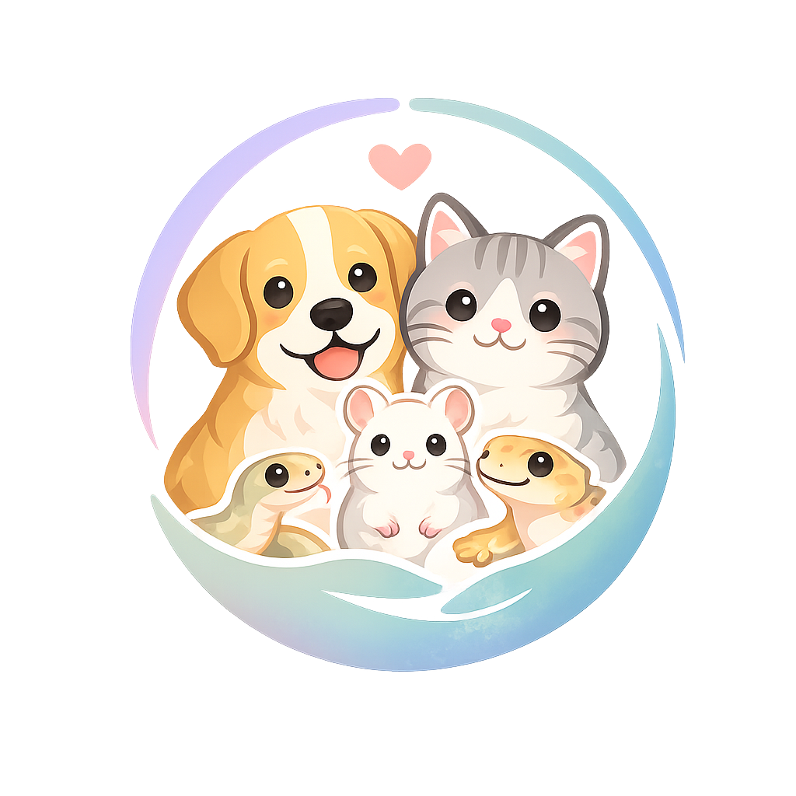
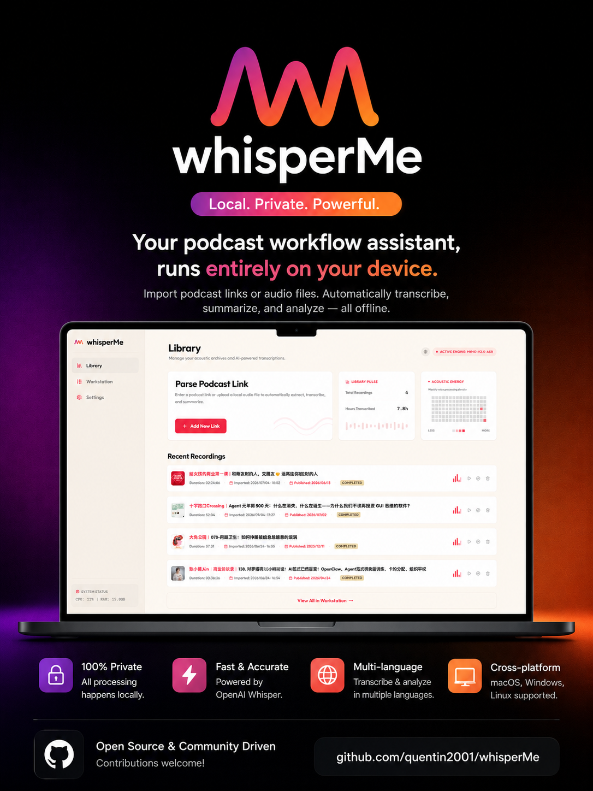
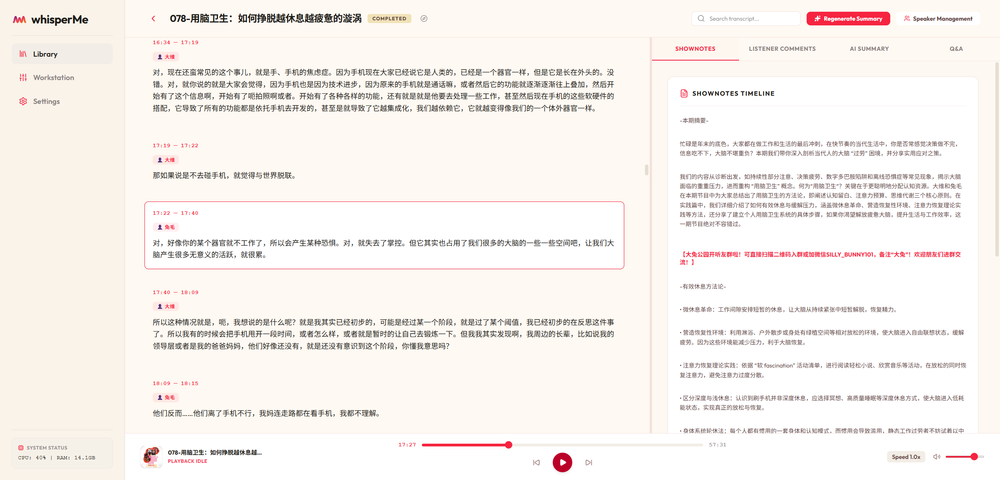
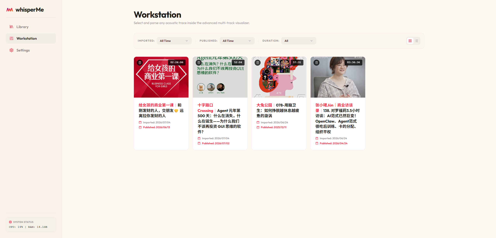
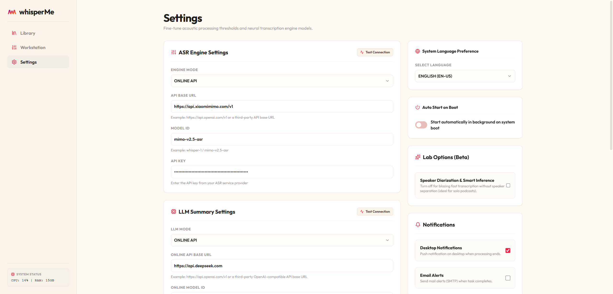
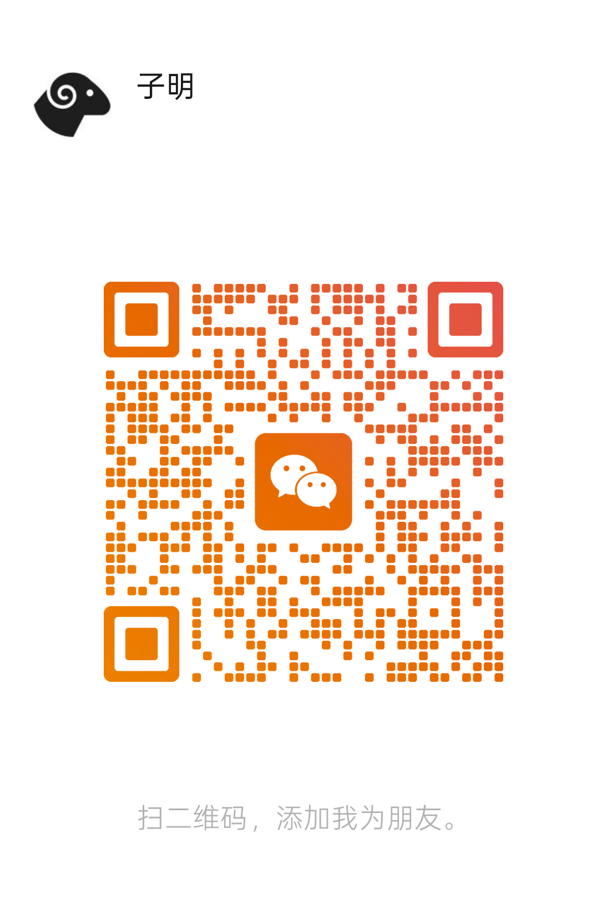
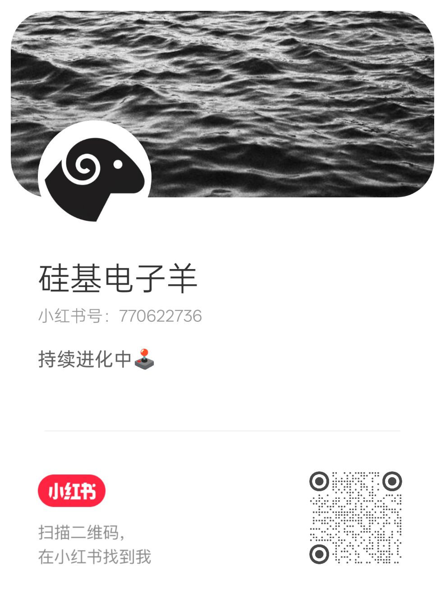
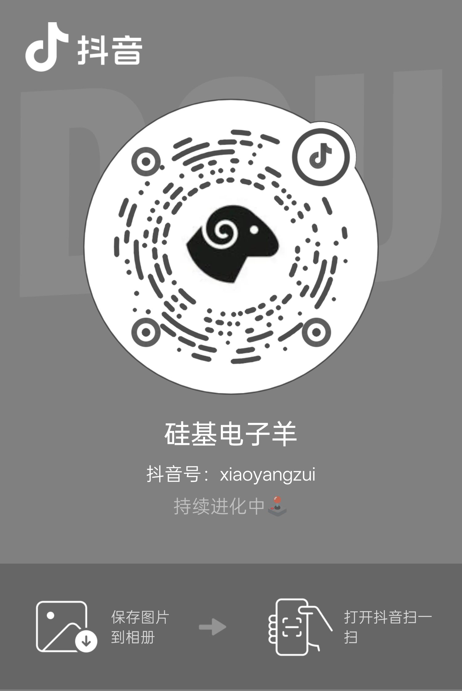

# 📢 How I AI?

这次路演我将向大家分享我是如何把 AI 深度织入自己的学习、开发和产品构想中的，以下是我这次路演的主要内容，我将从以下三个方向展开

1. **商业项目：宠物上门喂养小程序**：针对本地宠物上门服务的痛点，设计一个新的智能服务平台。
2. **开源项目：whisperMe 语音听写**：一个基于ASR-LLM的开源本地播客工具。
3. **AI探索历程**：使用AI的一些想法

  <a 
    href="/slides/roadshow" 
    target="_blank" 
    class="inline-flex items-center gap-3 px-8 py-4 bg-gradient-to-r from-indigo-500 via-purple-500 to-pink-500 hover:from-indigo-600 hover:via-purple-600 hover:to-pink-600 text-white font-bold rounded-2xl shadow-xl shadow-indigo-500/10 hover:shadow-indigo-500/25 hover:scale-[1.03] transition-all duration-300 no-underline cursor-pointer"
  >
    🖥️ 开启路演WebSlides
    <svg class="w-6 h-6 animate-pulse" fill="none" viewBox="0 0 24 24" stroke="currentColor">
      <path stroke-linecap="round" stroke-linejoin="round" stroke-width="2" d="M10 6H6a2 2 0 00-2 2v10a2 2 0 002 2h10a2 2 0 002-2v-4M14 4h6m0 0v6m0-6L10 14" />
    </svg>
  </a>

# 🐱 本地宠物上门服务

## 📋 产品分析

### 👥 用户与痛点 Who & What？
* **人群画像**：核心用户是**大城市高密度住宅区**的住户。
* **痛点本质**：宠物主人在**出差、出游、紧急事务**时，面临无法照看宠物的焦虑。
* **频次与周期**：需求极具**强周期性**（如节假日爆发），但对平台而言是**旱涝保收**的刚需。

### 🎯 价值主张与差异化 Why？
* **为什么现在做 Why Now？**：伴宠服务的**基础设施日趋成熟**，且养宠呈现明显的**精细化趋势**。
* **为什么是我们 Why Us？**：相比全国性大平台的同质化接单，我们能够提供**本社区邻里身份认证**以及**高标准的规范化履约流程**。

### 📊 市场规模 Market？（以单个大型高密度社区为例）
* **总市场**：整个城市有上门喂养需求的**数百万宠物主**。
* **可服务市场**：所在的特定大型社区，养猫狗的住户比例通常在 **10% 到 15%** 之间。
* **初期市场**：坚持**精细化运营**，初期先稳步做好 **100-200** 个核心高频客户。

### 💰 商业闭环与可行性 Business？
* **基础变现机制**：**基础喂养费**（按次/按宠物数量） + **节日服务溢价** + **增值服务**（如剪指甲、梳毛、给绿植浇水等）。
* **运营风险**：最大隐性成本是**安全与赔偿风险**。如果宠物在喂养期间生病、逃跑，或者客户家里财物丢失，如何界定责任？
* **风控保障**：构建**人工仲裁、平台双向协调、商业保险、服务保证金**等安全兜底体系。

## 💡 产品构建心得

1. 🚫 **不沉迷竞品分析**：盲从竞品容易陷入“答案唯一论”，从而失去产品原本的差异化和特色。
2. ⚡ **加入时代专属内容**：我们正处于技术变革周期内，新产品的设计必须吃足这一轮**技术周期变化的红利**。
3. 🎯 **第一性原理**：赚钱 ──> 创造价值 ──> 解决问题 ──> 识别真需求 ──> 迅速实践反馈，快速迭代 ──> 验证模型 ──> 撬动杠杆。
4. 📉 **最低的获客成本**：通过 **OPC（One Person Creator） + 小场景 + 创始人 IP** 的轻资产模式切入。

---

# 🎙️ whisperMe 开源博客工具

## 📋 产品分析

### 👥 用户与痛点 Who & What？
* **人群画像**：核心用户是具有强烈自我提升诉求的**知识工作者、开发者以及播客重度用户**。
* **痛点本质**：在通勤、运动等**碎片化或双手被占用**的场景下，无法随时记录灵感；而很多平台提供的“全自动 AI 总结”容易**剥夺用户的主动思考**。
* **频次与周期**：属于**极高频**需求，对于习惯用博客输入/输出信息的人来说，几乎每周甚至每天都在使用。

### 🎯 价值主张与差异化 Why？
* **为什么现在做 Why Now？**：语音转文字（ASR）和文本大模型（LLM）的 **API 成本已降到极低**，且识别与整理的**有效性极高**。
* **为什么是我们 Why Us？**：
  * **💡 理念差异**：市面上的产品多是“代劳”（替你总结），而 `whisperMe` 做的是“辅助”（定位为 **AI 辅助的认知工具**，引导个人反思与深度吸收）。
  * **🔒 开源与可定制**：允许用户接入自己的 Agent 工作流或本地运行模型，支持**自定义 prompt**，保护隐私且高度可控。

## 🖥️ 产品演示

## 💡 产品构建心得

1. 🔄 **需求来自于自己转型自己**：学会将日常“业务”中的流程资产，转化为可持续、可持久反复使用的**数字资产**。
2. 🌊 **接受形态 and 需求的变化**：在充满不确定性的周期中**先走一步**，而不是企图在最开始就找一个完美无缺的最终答案。
3. 🪒 **奥卡姆剃刀原理**：如无必要，勿增实体。切勿用较多的复杂架构，去解决用简单方式同样能做好的事情。
4. 📈 **增量开发是一门管理学**：制作出产品的 0.1 版本往往是无阻力的，但能让产品**长久、健康地活下去**才是真正的挑战。

## 📻 播客节目分享
> AI炼金术、the prompt、十字路口Crossing、WhynotTV、张小珺Jun|商业访谈录、罗永浩的十字路口、苔藓之火、屠龙大实话、搞钱女孩、晚点聊

---

# 🧠 使用 AI 的一些想法

* **既要做 builder 也要做 influencer**，做自媒体越来越像是一个必选题：获取信息、找角度、创作、节奏、输出正向价值观。
* **AI 创业的机会**：聚焦于生活中那些“有点烦、需要学习、受累了、缺少反馈”的真实小痛点。
* **闭环评估法则**：尝试完全自动 ──> 不行就退一步做辅助 ──> 真有用的话就融入业务流程，没用的话就先放置三个月再说。
* **如何对抗信息过载**：
  * 强调**可执行性**（看完是否有能落地的动作）。
  * 大道至简，坚持**“不造新词”**。
  * 评估其是否符合**常识**与基本商业规律。

---

# 📢 欢迎关注“回龙观造物所”！

