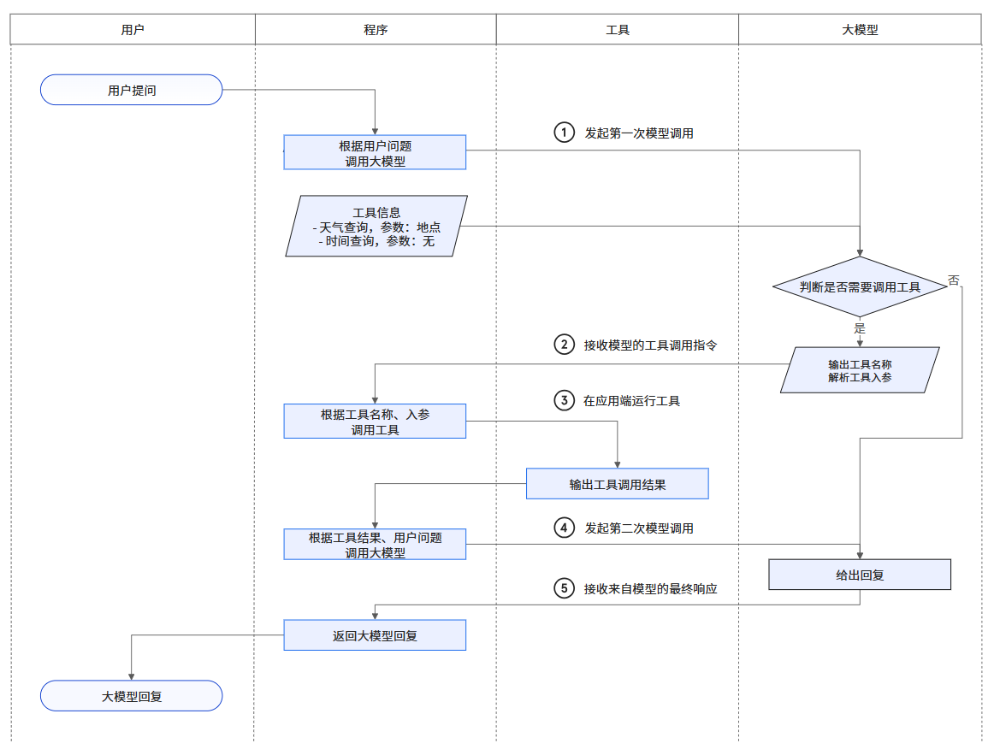

### 总览

### 1.🌰 栗子first

> 不用害怕看不懂，后面会逐步讲解


**逐步对应拆解：**

1. 我听说女朋友肚子疼，于是问AI agent或者说MCP client, 我女朋友肚子疼应该怎么办？
2. Agent把问题包装在user prompt中，然后agent通过MCP协议从MCP server里面获取所有tool的信息
3. Agent把这些tool的信息转化成system prompt或者转化成function calling的格式，然后和用户请求user prompt一起打包发送给AI模型。
4. AI模型发现有一个叫做web_browse的网页浏览工具可以用，于是通过普通回复或者function Calling格式产生调用这个tool的请求，希望去网上搜索答案。
5. Agent收到了这个请求之后，通过MCP协议去调用MCP server里的web browse工具。Web browse访问指定的网站并将内容返还给agent
6. agent再转发给AI模型
7. AI模型根据网页内容和自己的头脑风暴生成最终的答案---多喝热水，再返还给agent。
8. 最后由agent把结果展示给用户

### 2.🎶 从prompt说起

prompt一般来说prompt分为system prompt和user prompt

- system Prompt：系统预设的，用来设定AI模型的角色、性格、行为边界、规则
  > 用户不能随便更改system prompt，但网站也会提供一些设置，比如gpt里面有一个叫做customize chatgpt的功能，
  > 用户可以在里面写下自己的偏好，这些偏好就会变成system prompt的一部分。
- user Prompt：我们与大模型的聊天内容

不过说到底LLM还只是一个聊天机器人，在回答完问题后具体的操作还是得由你来完成，那么有没有办法让AI自己去完成任务呢？

### 3.🔥 爆火的开源Agent项目-AutoGPT


它让人看到AI可以连续执行任务，从思考到行动自动循环

**AutoGPT的工作机制**

他本质是一个本地程序，想让他来操作电脑完成任务则必须：

1. 编写一些函数（Tools）

- `get_install_url()`
- `search_web()`
- `install_software()`

2. 给每一个函数写一个说明（自然语言）

- 功能是什么
- 参数怎么写
- 返回什么格式

3. 把这些函数描述注册给AutoGPT
4. AutoGPT会把这些信息写进system Prompt
   例如：如果你想调用XXX工具，请返回-我要调用 + 工具名 + 参数

然后AutoGPT将system prompt和user prompt一起发给GPT模型

**我们来看一个例子**

1. 我输入：
   > 帮我找一下 CS 的安装地址
2. Agent(AutoGPT)将任务与可用工具写入system prompt交给AI模型，可能包含：
   ```javascript
   你可以使用函数 get_install_url(name)
   它用于查询软件的下载/安装地址
   返回格式必须为 JSON { "Tool": "get_install_url", "args": {...}}
   ```
3. AI模型 阅读prompt并推断需要实用工具，根据说明返回
   ```json
   { "Tool": "get_install_url", "args": { "name": "CS" } }
   ```
4. AutoGPT 解析 AI模型的输出，调用`get_install_url("CS")`
5. 工具返回结果给Agent，再由Agent继续发给 AI模型，可能返回
   ```json
   { "url": "D:/games/counterstrike" }
   ```
6. AI模型根据返回的结果继续resoning或给出最终回答
   > 你可以在 D:/games/counterstrike 找到 CS

人们把AutoGPT这种负责在模型、工具和最终用户之间传话的程序就叫做AI Agent，而那些提供给AI调用的函数或服务就叫做Agent Tools。

虽然 AutoGPT 强，但它依赖的是：AI 能否乖乖按照自然语言规则格式化输出。而 LLM 本质是概率模型，因此会出现忘记格式、缺少字段、JSON不合法等问题

于是 Agent 必须写很多“重试逻辑”：检查格式是否正确，不对就重新发给模型再试再试再试...像 Cline 等 Agent 至今仍使用“多轮重试”的策略。

于是我们就需要一种更可靠的机制来确保 AI 按照我们的要求进行格式化输出。

tips:

> 现在，随着下面即将要讲的 Function Calling 的广泛应用，上面反复错误后重试方式正在被取代。现代大模型在结构化调用时，并不是等它出错再重试，
> 而是利用 约束解码（constrained decoding）：在每一步生成 token 时，模型只被允许从「那些符合预定义 schema／合法结构」的 token 中选择。这样，非法 token 根本不会出现在它的备选里，也就避免了格式错误。
> 当然，重试机制并没有完全消失，它仍然可能用于处理 API 层面的网络抖动、限流、长上下文截断等问题。但格式层面的错误——现在已经更多由解码约束在生成时就拦截，而不是事后补救。

### 4.🔨 Function Calling：标准化的工具调用方式

> Function Calling 工作流程示意图如下所示，来源链接🔗https://help.aliyun.com/zh/model-studio/qwen-function-calling



为了解决刚才提到的“不稳定的输出格式”，模型厂商开始做统一标准，它不再用自然语言描述工具，而是使用**JSON Schema + 标准调用格式**

回到之前找CS安装地址的问题，我们通过system prompt告诉AI有哪些工具以及返回格式，但是这些描述都是用自然语言随意写的
Function Calling则对这些描述进行了标准化，将工具描述和返回格式都用JSON描述，这样Agent就可以根据JSON的格式进行解析，从而实现功能调用。
例如：

```json
"tools": [
    {
      "name": "get_install_url",
      "description": "Get the installation URL of a software",
      "parameters": {
        "type": "object",
        "properties": {
          "software": {
            "type": "string",
            "description": "The name of the software"
          }
        },
        "required": ["software"]
      }
    }
]
```

然后AI使用工具时的回复也都依照相同的格式

```json
"tool_calls": [
    {
      "id": "call_123",
      "type": "function",
      "function": {
        "name": "get_install_url",
        "arguments": "{\"software\":\"CS\"}"
      }
    }
]
```

于是人们就能更加有针对性的训练AI模型，让他理解这种调用的场景以及什么是funcition calling和按照什么格式调用工具
在这种情况下如果AI生成了错误的回复，因为回复的格式是规定的，AI服务器端自己就可以检测到并且进行重试，用户根本感觉不到
不仅降低了用户端的开发难度，也节省了用户端重试带来的Token开销，正是由这些好处，现在越来越多的AI Agent开始从system Prompt转向Function Calling

**当然Function Calling仍然不是完美的**

虽然各大厂都支持 function calling，但：

- 每家厂商的格式略有差异
- 早期开源模型不支持

想写一个“跨模型通用 Agent”依然很麻烦

因此，目前市面上：system prompt + function calling 并存。

而且这只是 AI模型 ↔ Agent 之间的通信方式。接下来我们来讲 Agent ↔ 工具（Tool）之间的通信。

### 5.🤖 Tools如何提供给Agent？MCP给出答案


**Tools如何提供给Agent呢？**

最简单的做法是把AI Agent和Agent Tools写在同一个程序里直接内部函数调用搞定，这也是大多数Agent的做法，但是后来人们逐渐发现，有些Tool的功能其实挺通用的，可以解耦出来把Tool变成服务统一托管，让所有的Agent都来调用，这就是MCP（Model Context Protocol），MCP是一个通信协议专门用来规范Agent和Tools服务之间是怎么交互的

运行Tool的服务叫做MCP server调用它的Agent叫做MCP Client，MCP规定了MCP server如何和MCP Client通信，以及MCP Server要提供哪些接口，比如说用来查询MCP server中有哪些Tool、Tool的功能、描述需要的参数、格式等等的接口

除了普通的Tool这种函数调用的形式MCP Server也可以直接提供数据提供类似文件读写的服务叫做Resource，或者为Agent提供提示词的模板叫做prompt，MCP Server既可以和Agent跑在同一台机器上通过标准输入输出进行通信，也可以被部署在网络上通过HTTP进行通信

这里需要注意的是虽然MCP是为了AI而定制出来的标准但实际上MCP本身却和AI模型没有关系，他并不关心Agent用的是哪个模型，MCP只负责帮Agent管理工具、资源和提示词MCP的目标是统一Agent与外部世界的能力接口，让AI能访问“操作系统级能力”

**MCP的优势**

- 工具复用：一个工具可被任何 Agent 使用
- 统一格式：所有工具都是同一种描述方式
- 解耦：工具与 Agent 彻底分离
- 跨平台：可以用在本地、云端、VSCode、浏览器等环境
- 模型无关：不绑定 GPT、Claude、Llama

这让 Agent 的生态有了“插件系统”的可能。

### 6.🔙 回看样例


综上就是system prompt、user prompt、AI agent、agent to function calling、MCP、AI模型之间的联系与区别了

他们不是彼此取代的关系，而是像齿轮一样，一起构成了AI自动化协作的完整体系

**再举一个🌰**

> 用户（客户） → Agent（项目经理） → 模型（顾问） → MCP Server（外包工具团队）

1. 用户把需求告诉项目经理（Agent）。
2. 项目经理不会自己想答案，于是把需求转给顾问（AI 模型）。
3. 同时，项目经理还会把手上所有“可用外包团队”（MCP Server 提供的工具列表）发给顾问看。
   早期，项目经理只能用自然语言解释这些团队的服务范围（system prompt），说不清楚时顾问就会误解。
   后来大家统一用一份结构化的“外包团队服务手册”（Function Calling / JSON Schema），顾问就不会理解错误。
4. 顾问分析后告诉项目经理：“要完成需求，需要叫这个外包团队（某个 tool）来做”。
5. 项目经理自己去调用外包团队的接口（MCP Server），拿到结果后再给顾问复核。
6. 顾问确认结果满足需求后，项目经理把最终成果交给用户。

在 MCP 语境下：

- 项目经理 = MCP Client
- 外包团队 = MCP Server

### 7.❓ 我的疑问总结

1. 问：如果有大量 MCP 服务节点，把所有工具的 schema 放进 system prompt，不会超过 LLM 的上下文极限吗？

   答：不会。现代 Agent 系统不存在“把所有工具一次性塞给模型”的做法。工程上有三层优化策略。

   1. 工具是“按需注入”（On-Demand Injection）
      Agent 会根据任务意图筛选工具，例如：
      用户提到“查文件”，只加载 file 系工具
      用户提到“浏览网页”，只加载 browse 工具
      常见的方法包括意图识别（Intent Classification）与工具类型匹配。
      最终模型只看到与当前任务相关的少量工具，而非全部服务节点。
   2. 工具通过“向量检索”选择（Vector-Based Tool Retrieval）
      每个工具的描述会被向量化
      当用户提出需求时，Agent 检索出 Top-K（通常 3〜10 个）最相关的工具注入模型。
      这种做法让工具数量从几十到几万都不影响 prompt 大小。
   3. 工具 Schema 不一定放在 prompt，而是通过模型 API 的“结构化字段”传入
      在 OpenAI / Anthropic / Google 的 function/Tool calling 中：
      工具 schema 是一个独立字段
      不占用上下文 token
      不以系统提示词形式写入 prompt
      模型内部使用结构化约束解析调用，不影响上下文容量。
   4. 📌 总结（适合写成一行）
      工具不是“塞进 prompt”，而是“筛选后以结构化方式注入”。工具越多，对上下文压力越小，因为只有相关工具会进入模型。

2. 问：为什么和我理解的Agent又好像不一样了呢：

   答：广义的 Agent 指整个系统级智能体，包括大模型、工具/MCP 服务、记忆和工作流等，能够感知、规划、决策并执行任务。
   狭义的 Agent 则通常特指负责任务规划和工具选择的模块，核心由 LLM 提供推理和决策能力。
   换句话说，广义是“系统整体”，狭义是“决策调度组件”，两者层级不同，但都以 LLM 为核心智能来源。

3. 问：整体上怎么理解 MCP 工具与大模型的关系？
   答：MCP 工具的选择和调用依赖大模型的推理能力，但现代系统会结合意图识别和代理层，兼顾工具丰富性和上下文效率。大模型负责理解和决策，Agent/中间层负责工具调用和结果管理。

4. 问：MCP 是不是直接给 LLM 使用的协议？LLM 是否可以直接使用 MCP 来调用工具？
   答：不是。MCP 是 Agent 与工具之间的标准通信协议，负责协调工具调用和数据流。LLM 本身无法主动发起交互，它只负责生成文本，实际调用和执行由 Agent 负责。MCP 是 Agent 的接口，不是 LLM 的接口。

5. 问：Function Calling (函数调用) 与 MCP 是什么关系？谁取代了谁？
   答：它们是不同层面上的互补关系，不存在取代。
   - Function Calling： 是 LLM 内部的输出机制。它是一种让 LLM 能够生成结构化 JSON 来表达调用意图的能力。
   - MCP： 是 LLM 外部的通信标准。它定义了工具如何向 Agent 暴露自身能力，以及 Agent 如何与工具进行数据流传输的规范。
   - 协同方式： Agent 会将 MCP 工具的标准化定义转换为 LLM 可以理解的 Function Calling Schema 喂给 LLM。LLM 利用 Function Calling 发出指令，Agent 利用 MCP 执行指令。

我个人的疑问：

1. Agent里面是不是还有一个LLM？LLM不应该是Agent的大脑吗？Agent可以不包含LLM是么？在图片里面LLM和Agent是分开的吗？Agent到底是不是LLM再加上一些东西的集合呢，还是说在图片里Agent也包含着一个LLM，不过旁边也有一个LLM？
   **“Agent 是不是 = LLM？Agent 必须包含 LLM 吗？为什么有些图把它们画开？”**
   ✅ **核心先导结论（一句话版）**
   **Agent ≠ LLM。
   LLM 只是 Agent 的“大脑”，但 Agent 不是必须包含 LLM。
   Agent 是更大的系统范畴，而 LLM 是其中可能存在的一部分。**
   **1. LLM 是“推理大脑”，Agent 是“系统角色”**

- **LLM（大模型）**负责思考、推理、理解自然语言。
- **Agent**负责把“推理能力”放到一个系统中运作起来：
  - 接收任务
  - 规划步骤
  - 调用工具
  - 管理上下文
  - 处理错误
  - 维护长期状态（记忆、项目、任务树）
  - 与人交互
    👉 **Agent 是会“用一个大脑做事”的系统，而 LLM 就是其中的一块大脑。**
    📌 **2. Agent 里面是不是一定含 LLM？不一定。**
    很多情况下：
    ✔ **现代 AI Agent 一般都会包含一个 LLM**
    因为它需要推理能力、生成语言，并且做工具选择。
    ✖ **但从软件工程定义看，Agent 不一定需要 LLM**
    例子：
  - 传统 Multi-Agent 系统（MAS）中，Agent 是一堆专家系统（无 LLM）
  - 游戏 NPC 也是 Agent（基于规则系统）
  - 智能推荐流程也可以被称为 Agent（无 LLM）
    **Agent 这个词比 LLM 年代更早，也更广义。**
    📌 **3. 那为什么很多图会把 Agent 和 LLM 画成两个方块？**
    因为你看到的图通常表达的是：
    > **“Agent 系统”调用“LLM 模块”，而不是反过来。**
    > 也就是说：
  - Agent 是 orchestrator（编排器）
  - LLM 是 reasoning engine（推理引擎）
    **就像浏览器（Agent）调用渲染引擎（LLM）一样。**
    📌 **4. 那 Agent = LLM + 一些东西，这个定义对吗？**
    答：**80% 的现代 Agent 确实是这样的 ——
    LLM + Memory + Tools + Workflow + Error Handling。**
    但这个定义不能覆盖全部情况，因为：
  - 有些 Agent 并不包含 LLM（如传统智能体）
  - LLM 也可以独立作为 Agent（如最简单的“纯对话 Agent”）
  - Agent 可以包含多个 LLM（路由模型、工具模型、助手模型等）
    👉 **用“LLM + 一些周边能力”描述现代 Agent 是实用的，但不是理论定义。**
    📌 **5. 最标准、最通用的定义（建议你在文章中采用）**
    **Agent（智能体）＝
    能感知环境、做出决策并采取行动的系统。**
  - 感知（输入）
  - 决策（推理）
  - 行动（执行）
    LLM 只是 **“强决策能力的模块”**。
    现代 AI Agent 通常是：
    \*\*LLM（推理）
  - 工具（行动）
  - 工作流（规划）
  - 状态管理（记忆、上下文）
  - 接口（看世界、影响世界）\*\*
    所以：
    > **Agent「可以」包含 LLM，但不是所有 Agent 都必须包含。
    > LLM「可以」独立作为一个弱 Agent，但通常不够强。**
    > 📌 **一句极简版总结（你可以放博客里）** > **LLM 是 Agent 的“大脑”，但 Agent 是比 LLM 更大的系统。
    > Agent 不一定包含 LLM，而现代 AGI 风格的 Agent 绝大多数都包含。
    > 在技术图里把 Agent 和 LLM 分开，是为了强调：LLM是能力，Agent是系统角色。**

3. system prompt是什么时候传给LLM的？system prompt有没有消耗token？实际每一次对话的时候都会传一遍吗？system prompt里面会具体包含什么东西？

4. 为什么现在人人都在讨论 MCP？因为所有人意识到：真正的 AI 革命，不是更聪明的模型，而是“模型能做更多事情”。而让模型“做事情”的关键就是：
   能力接入标准化 → 工具复用 → 不同模型之间共享能力。
