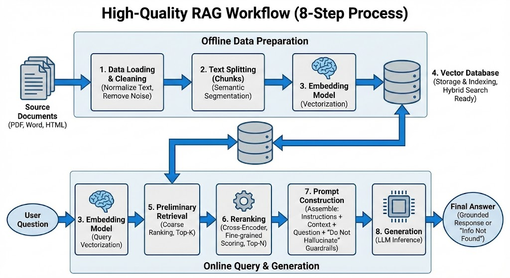
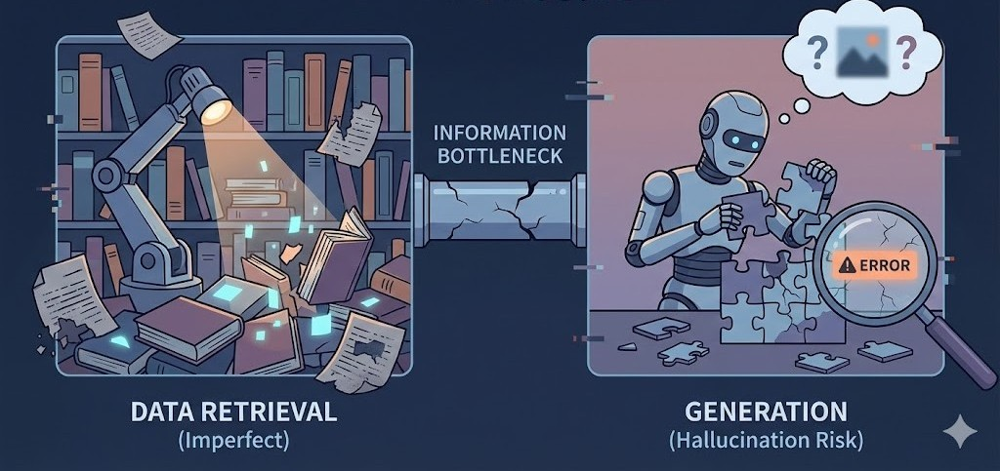

相信每个人在学习或工作过程中都会记点什么整理些什么。我从最早的手写笔记开始--写到某个本子上，到后来用本地软件--word、excel、ppt，再到后来可以云端存储的软件--幕布->腾讯文档->语雀->飞书，最近又接触了NotebookLM，我现在是飞书+NotebookLM的组合。

知识库这个应用场景，不仅对于个人比较重要，对于企业来说构建自己的智能知识库也会很有价值，因为一个企业的知识资产就约等于“这家企业”，如果能有效且高效的使用企业的知识资产，势必能够提高企业的效率和商业获利，目前飞书推出了知识问答，是很好的知识库应用。

## 📚 个人知识库搭建学习笔记

### 💻 1. 检索增强生成 (RAG)

#### RAG 的概念和产生契机

RAG（Retrieval-Augmented Generation，检索增强生成）是一种 AI 检索机制，主要用于构建个人知识库。

**产生契机：**
大型语言模型（LLM）的训练数据是有限的，且无法实时更新最新信息，同时存在“幻觉”（生成不准确信息）的风险。RAG 机制应运而生，它通过**外部知识检索**来增强 LLM 的生成能力，使其能够基于特定、最新的或私有的文档提供准确的答案。

#### RAG 的工作原理

它首先从外部知识库中检索相关信息，然后将这些信息与用户查询一同提供给大模型（LLM），由 LLM 基于这些上下文信息生成最终回答。

#### RAG 工作环节及涉及到的组件



一个高质量的 RAG 工作流通常涉及以下关键环节和组件：

1.  **数据处理与清洗 (Data Loading & Cleaning):** 将 PDF、Word、HTML 等源文件统一转换为纯文本并去除噪音，确保输入数据的高质量，避免垃圾数据影响检索精度。
2.  **文本分割 (Text Splitting):** 将长文档切分为语义相对完整的小块（如使用 `RecursiveCharacterTextSplitter`），以适配 LLM 上下文限制并提高检索颗粒度。
3.  **嵌入模型 (Embedding Model):** 将文本块转化为数值向量以捕捉语义信息，该模型在数据入库和用户提问两个阶段通用。
4.  **向量数据库 (Vector Database):** 存储向量并建立索引，支持毫秒级检索，通常结合关键词匹配（混合检索）来提升专有名词的命中率。
5.  **初步检索 (Retrieval):** 基于向量相似度，从数据库中快速召回一批（如 Top 50）与用户问题最相关的候选文本片段。
6.  **重排序 (Reranking):** 使用高精度的 Cross-Encoder 模型对候选片段重新打分排序，筛选出最精准的 Top-N 结果，这是大幅提升准确率的关键。
7.  **提示词构建 (Prompt Construction):** 将指令、筛选后的上下文和问题组装在一起，并注入“若无答案请直接告知”的防御性指令，有效防止模型编造答案。
8.  **生成 (Generation):** LLM 根据组装好的 Prompt 进行推理，综合上下文生成流畅回答，或在缺乏信息时诚实反馈“未找到相关信息”。

#### RAG 的局限性及存在的问题



尽管 RAG 是强大的工具，但实际体验中可能不如预期，经常会遇到各种奇怪的问题。

主要的局限性包括：

1.  **数据解析难题：** 难以完美提取 PDF、表格、扫描图片等复杂非结构化文档中的信息。
2.  **切分策略两难：** 文本切分太小丢失语义，太大引入噪音，缺乏通用的完美策略。
3.  **知识维护成本高：** 知识库中新旧数据冲突会导致回答矛盾，且及时清理过时数据非常耗时。
4.  **语义匹配鸿沟：** 用户口语化提问与文档专业表述存在差异，即使是向量检索也常产生遗漏。
5.  **“迷失中间”现象：** 当检索内容过多时，大模型容易忽略掉位于长上下文中间位置的关键信息。
6.  **跨文档能力弱：** 擅长单点查询，但难以应对需要综合多个零散文档片段才能得出的复杂结论。
7.  **幻觉无法根除：** 检索到的信息本身有误导性或噪音太多，模型依然会“一本正经地胡说八道”。
8.  **拒答边界难以掌控：** 很难精准调教模型在“不知道时诚实回答”与“稍微匹配度低就拒绝回答”之间取得平衡。
9.  **系统延迟明显：** 冗长的处理链路（向量化->检索->重排->生成）响应较慢，很难满足实时性。
10. **运行成本高：** 高质量 Embedding、向量数据库及 LLM 处理长上下文叠加了高昂的费用。

### 📷 2. 图检索增强生成 (GraphRAG)

#### GraphRAG 产生的契机

标准 RAG（我们前面讨论的基于向量的 RAG）虽然强大，但在处理复杂现实问题时，很快就撞到了天花板。GraphRAG 的出现正是为了突破这些天花板：

**痛点 1：只见树木，不见森林 (缺乏全局视角)**

- 标准 RAG 的局限： 标准 RAG 把文档切成一个个孤立的碎片（Chunks）。当你问一个宏观问题，比如“这几千份财报里反映出的主要市场趋势是什么？”时，标准 RAG 会不知所措。因为它只能找到一些零散的、包含“趋势”这个词的段落，无法把这些碎片拼凑成一个完整的宏观图景。
- GraphRAG 的契机： 它试图建立数据之间的连接结构，让 AI 拥有“上帝视角”，能回答跨文档的总结性问题。

**痛点 2：难以“顺藤摸瓜” (多跳推理能力弱)**

- 标准 RAG 的局限： 如果问题的答案需要跨越多个文档建立连接，标准 RAG 往往会失败。例子： 文档 A 说“张三是 A 公司的 CEO”；文档 B 说“A 公司刚被 B 公司收购”。如果你问“张三现在的老板是谁？”，标准 RAG 很难把这两个分散的事实关联起来得出结论。
- GraphRAG 的契机： 通过显式地建立“实体”之间的关系，GraphRAG 天生就适合做这种推理。它知道“张三 -> 管理 -> A公司”，也知道“B公司 -> 收购 -> A公司”，顺着这条链条就能找到答案。

#### GraphRAG 的工作原理详解

GraphRAG 的核心在于“先构建地图，再按图索骥”。它不只是简单地存储文本碎片，而是预先梳理出数据内部的结构和关联。其工作流程比标准 RAG 更为复杂深入，主要体现在独特的索引构建阶段：

**阶段 1：构建知识地图 (图谱索引构建)**


这是 GraphRAG 最核心、也是最耗时的“重活”。在数据入库时，系统不再仅仅是进行文本切片和向量化。

1.  **信息抽取 (Extraction)：**
    利用一个强大的大语言模型（LLM）化身为“情报分析员”，深度研读原始文档，从中精准识别出关键要素：

    - **实体 (Entities)：** 文档中出现的人名、地名、机构名、产品名、核心概念等，它们构成了知识图谱中的“节点”。
    - **关系 (Relationships)：** 实体之间存在的连接方式，例如“张三 _就职于_ A公司”、“iPhone _属于_ 智能手机类别”，它们构成了图谱中的“边”。

2.  **构建图谱 (Graph Construction)：**
    将上述提取出的海量实体和它们之间的关系，有机地连接起来，编织成一张巨大的网状结构图（知识图谱）。

3.  **社区摘要 (Community Summarization) [核心创新]：**
    面对庞大的知识图谱，直接检索依然困难。GraphRAG 引入了巧妙的一步：
    - 运用图算法找出图谱中联系紧密的“小圈子”或“社群”（Community）。
    - 随后，让 LLM 为每一个“小圈子”生成一份高度凝练的摘要总结。
    - _比喻：_ 这就像在绘制世界地图时，不仅标出了每个具体的城市（实体），还预先写好了“亚洲概况”、“欧洲概况”等区域性的简介（社区摘要）。

**阶段 2：利用地图导航 (检索与生成)**


当用户发起提问时，GraphRAG 提供了更灵活、更强大的检索方式：

1.  **全局检索 (Global Search - 应对宏观问题)：**

    - 当用户提出如“这些文档总体上反映了什么趋势？”这类宏观问题时，系统无需费力地翻找无数零散碎片。
    - 它可以直接调取预先生成好的高层次“社区摘要”。LLM 阅读这些摘要后，能迅速生成一个全面、宏观的回答。

2.  **局部检索 (Local Search - 应对具体问题)：**
    - 当用户询问如“实体A和实体B有什么联系？”这类具体问题时，系统会在图谱中定位到这两个节点。
    - 它会沿着连接节点的路径（边）进行探索，并查看周围的邻居节点信息，从而获取标准 RAG 难以提供的丰富背景和关联上下文。

#### GraphRAG 的现实挑战与未来演进

GraphRAG 确实强大，它解决了标准 RAG“只见树木不见森林”和“推理能力弱”的痛点，被视为 RAG 的未来方向。
然而，如果说标准 RAG 是灵活的“轻骑兵”，那么现阶段的 GraphRAG 更像是火力强大但极其昂贵笨重的“重装坦克”。

目前 GraphRAG 面临的四大核心局限性：

**1. 成本极其高昂 (“天价”索引费)：**
这是最大的拦路虎。与标准 RAG 廉价的 Embedding 不同，GraphRAG 在索引阶段需要动用昂贵的 LLM 深度精读数据、抽取实体关系并生成海量摘要。处理同样的数据，其 Token 费用可能是标准 RAG 的百倍甚至千倍，前期沉没成本巨大。

**2. 工程复杂度爆炸与维护噩梦：**
架构上通常需要同时维护向量数据库和图数据库。更致命的是数据更新困难：源文档修改一句话，可能会牵连图谱中无数节点、边和摘要，精准更新而不推倒重来的工程难度极大。

**3. 极度依赖信息抽取质量：**
地基是图谱。如果 LLM 在抽取阶段出现实体识别错误或关系混淆，建立的图谱就是歪的。基于错误地图的导航，结果必然南辕北辙，且修复极其困难。

**4. 延迟问题明显：**
图数据库的复杂查询通常慢于向量检索。特别是进行跨节点多跳推理或需要读取大量摘要的全局查询时，响应速度往往难以满足实时交互需求。

**破局者：LightRAG 与 LazyGraphRag**

业界已意识到原始 GraphRAG 的痛点，开始寻求优化路径，核心目标都是“降本增效”：

- **LightRAG (敏捷挑战者)：** 代表了**轻量化、工程化**方向。通过“做减法”，简化复杂的摘要生成流程，并更巧妙地融合向量与图检索，强调与成熟工业标准（如 Neo4j）的兼容落地。
- **LazyGraphRag (巨头的自我革命)：** 核心思想是**惰性求值 (Lazy Evaluation)**。将巨大的前期索引成本转化为查询时的按需计算。不再预先构建所有内容，而是等用户提问时，再根据问题按需构建相关的局部图结构或生成摘要。

**结论：** GraphRAG 指明了引入结构化知识的正确方向，但第一代实现过于昂贵。当前正处于优化阶段，未来很长一段时间内，**平衡图谱构建成本与检索收益**将是该领域的核心课题。

### 📝 3. 手工造轮子搭建知识库：企业 IT 技术支持智能助手

**场景痛点：**
公司 IT 部门每天要处理大量重复性问题（如“VPN 连不上”、“邮箱密码过期”、“打印机没反应”）。这些解决方案散落在：

1.  旧系统的 Wiki 页面（HTML 格式，排版混乱）。
2.  新采购软件的 PDF 操作手册（格式规整，但篇幅很长）。
3.  IT 专员自己记录的 Markdown 故障排除笔记（非结构化文本）。

**目标：**
搭建一个 RAG 系统，让员工直接提问，系统能从这些杂乱的文档中找到确切的解决步骤回复员工。

#### 一、 技术选型方案 (The "Golden Stack")

| 组件角色               | 推荐技术选型                        | 理由                                                                                                            |
| :--------------------- | :---------------------------------- | :-------------------------------------------------------------------------------------------------------------- |
| **编排框架 (指挥官)**  | **LangChain (Python版)**            | 行业标准，生态最丰富，提供了连接所有组件的胶水代码，虽然上手稍陡峭，但值得投入。                                |
| **数据处理 (清洁工)**  | **Unstructured.io**                 | 强大的开源库，专门对付各种烂格式文档（HTML, PDF, Word），能清洗掉很多噪音。                                     |
| **Embedding (翻译官)** | **OpenAI `text-embedding-3-small`** | 目前性价比和效果的最佳平衡点。对于通用领域知识，它比大多数需要自己部署的模型都要好。                            |
| **向量数据库 (仓库)**  | **ChromaDB**                        | 对新手最友好。起步不需要安装服务器，数据以文件形式存在本地，需要上生产环境也可以切换到服务器模式。              |
| **重排序 (质检员)**    | **Cohere Rerank API**               | **提升 RAG 质量的关键一步。** 很多入门教程为了省事省略了它，但它是区分玩具和产品的关键。Cohere 是该领域的标杆。 |
| **大模型 (大厨)**      | **OpenAI `gpt-4o-mini`**            | 速度快、价格便宜、足够聪明，非常适合做 RAG 的末端生成。                                                         |

#### 二、 8步全流程指导与案例推演

**第一阶段：离线数据准备 (Data Preparation Pipeline)**

这个阶段的任务是把杂乱的文档变成整齐的、贴好标签的“预制菜”，存入仓库。这通常只需执行一次，或定期更新。

**步骤 1：数据处理与清洗 (Data Loading & Cleaning)**

- **目标：** 统一源文件格式，去除噪音。
- **IT助手案例：**
  - 系统读取 Wiki 的 HTML 文件，使用 `Unstructured` 库去除了导航栏、广告、页脚链接，只保留了正文文本。
  - 读取 PDF 手册，识别并去除了每页都有的“XX公司机密”水印页眉。
- **关键动作：** 标准化为纯文本。

**步骤 2：文本分割 (Text Splitting / Chunking)**

- **目标：** 将长文本切分成语义相对完整的小块（Chunk）。
- **IT助手案例：**
  - 那本 100 页的 PDF 手册不能直接存。我们使用 `RecursiveCharacterTextSplitter`（递归字符切分器）。
  - 设定每块大小约为 500 个字符（token），并设定 50 个字符的“重叠区 (Overlap)”。
  - _为什么要有重叠区？_ 假设一句话“如果遇到错误代码 503，请重启路由器”不幸被从中间切开了。重叠区能保证这句话完整地出现在前一块的结尾和后一块的开头，避免语义丢失。

**步骤 3：嵌入模型 (Embedding)**

- **目标：** 将文本块转化为计算机能理解的向量（一串数字）。
- **IT助手案例：**
  - 一个文本块内容是：“VPN 连接失败时，请检查 GlobalProtect 客户端版本是否为 5.2 以上。”
  - 该块被发送给 OpenAI Embedding API，返回了一个包含 1536 个数字的列表 `[-0.023, 0.881, ...]`。这个向量就代表了这句话的语义。

**步骤 4：向量数据库 (Vector Database)**

- **目标：** 存储向量和原文，建立索引。
- **IT助手案例：**
  - LangChain 调用 ChromaDB，将上面生成的成千上万个向量及其对应的原始文本块，存入了你本地硬盘的一个文件夹里，并建立了高效的索引结构（类似于图书馆的分类卡片）。

**第二阶段：在线检索与生成 (Retrieval & Generation Pipeline)**

这个阶段是用户提问时实时触发的流程。

**步骤 5：初步检索 (Preliminary Retrieval / Coarse Ranking)**

- **目标：** 快速召回一批可能相关的候选集（宁滥毋缺）。
- **IT助手案例：**
  - 用户提问：“我电脑连不上内网了，怎么办？”
  - 问题首先被转化为向量。
  - ChromaDB 拿着问题向量在数据库里进行“余弦相似度”计算，找出最相似的前 **20条** (Top-K=20) 记录。
  - _现状：_ 这 20 条里，可能前 5 条是真正讲 VPN 故障排除的，但也混入了 5 条讲“内网安全规范”的无关文档，因为它们都包含“内网”这个词。

**步骤 6：重排序 (Reranking)** —— _关键提升点_

- **目标：** 从候选集中精选出最相关的几条（优中选优）。
- **IT助手案例：**
  - 系统将用户问题和这 20 条候选文档一起发送给 Cohere Rerank API。
  - 重排序模型是一个更“懂行”的模型，它会逐一仔细阅读，发现那些讲“安全规范”的文档虽然有关键词，但解决不了用户的问题，因此给它们打了低分。而真正讲排除步骤的文档得了高分。
  - 系统最终只保留得分最高的 **Top 3** 文档。

**步骤 7：提示词构建 (Prompt Construction)**

- **目标：** 组装所有信息，并加上防幻觉的“紧箍咒”。
- **IT助手案例：**

  - LangChain 按照预设模板组装 Prompt：

  ```text
  系统指令：你是一个专业的 IT 支持专家。请仅基于以下提供的【参考文档】来回答用户的问题。如果【参考文档】中没有包含答案，请诚实地说“抱歉，知识库中暂时没有相关解决方案”，严禁编造。

  【参考文档】：
  文档1内容：[VPN连接失败的检查步骤...]
  文档2内容：[如何重置网络设置...]
  文档3内容：[常见错误码说明...]

  用户问题：“我电脑连不上内网了，怎么办？”
  ```

**步骤 8：生成 (Generation)**

- **目标：** LLM 阅读资料，输出最终回复。
- **IT助手案例：**
  - OpenAI `gpt-4o-mini` 接收到上面的 Prompt。
  - 它阅读了参考文档，识别出了与用户问题匹配的解决方案步骤。
  - 它用流畅、礼貌的语言组织回答：“您好，根据知识库记录，电脑无法连接内网通常有以下几种原因。请您尝试以下步骤进行排查：1. 检查 GlobalProtect VPN 客户端版本... 2. 尝试重置网络设置...”

### 🤖4.使用现成工具搭建知识库：Dify

Dify ([https://dify.ai/](https://dify.ai/)) 是目前最火的开源 LLM 应用开发平台之一。它最大的价值在于**把我们刚才痛苦手工搭建的那 8 个步骤，全部封装成了可视化的界面和自动化的流程**。

你不再需要写 Python 代码去调用 LangChain，只需要在网页上点点鼠标、配配参数。

**核心差异对比：手工搭建 vs. Dify**

| 环节                | 手工搭建 (Python + LangChain)                          | Dify 平台搭建                                            |
| :------------------ | :----------------------------------------------------- | :------------------------------------------------------- |
| **数据处理**        | 写代码用 `Unstructured` 清洗，写代码调用 Splitter 切分 | **可视化界面上传文件，傻瓜式配置切分规则**               |
| **Embedding与存储** | 写代码调用 API，写代码初始化 ChromaDB 并存入           | **后台自动完成，你只需在下拉菜单选模型**                 |
| **检索与重排序**    | 写代码实现检索逻辑，手动对接 Cohere Rerank API         | **在界面上勾选“混合检索”和“Rerank”，填个 API Key 就行**  |
| **Prompt构建**      | 在代码里用 f-string 或模板拼字符串                     | **所见即所得的 Prompt 编辑器，用 `{{变量}}` 插入上下文** |
| **整体编排**        | 自己写逻辑胶水代码把流程串起来                         | **开箱即用的“对话应用”框架，或者拖拉拽的 Flow 画布**     |

#### Dify 知识库搭建方案 (以 IT 助手为例)

假设你已经部署好了 Dify（本地 Docker 或云端版），并且在设置里配置好了 OpenAI 和 Cohere 的 API Key。

我们将流程分为两个大块：**构建知识库（准备数据）** 和 **构建应用（使用数据）**。

**第一阶段：构建知识库 (The Data Workshop)**

_对应手工步骤 1-4：数据清洗、切分、Embedding、存入向量库。_

在 Dify 中，这一步被高度自动化了。

**步骤 1：创建知识库并上传文件**

1.  在 Dify 顶部导航栏点击 **“知识库 (Knowledge)”** -\> **“创建知识库”**。
2.  选择 **“导入已有文本”**。
3.  **案例操作：** 上传你们公司的 IT 文档，比如 `VPN操作手册.pdf`, `邮箱常见问题.docx`, `打印机故障排除.md`。

**步骤 2：数据处理与清洗配置 (关键)**
Dify 会询问你如何处理这些文件。为了高质量，不要选“自动”，要选 **“自定义”**。

- **分段设置 (Chunking)：**
  - 这对应手工的 `TextSplitter`。
  - **推荐配置：**
    - 分段标识符：通常用 `\n\n` (按段落切分)。
    - 分段最大长度：比如设置为 `500` 到 `800` tokens。
    - 段落重叠：设置 `50` tokens (用于保持语义连贯性)。
- **数据清洗：**
  - Dify 会自动尝试清理 HTML 标签等噪音，你可以预览分段效果，看看切得对不对。

**步骤 3：索引与 Embedding 配置**

- **索引方式：**
  - 一定要选 **“高质量 (High Quality)”**。如果选“经济”，它只做关键词匹配，就不是真正的向量 RAG 了。
- **Embedding 模型：**
  - 在下拉菜单中选择已配置好的模型，例如 **OpenAI `text-embedding-3-small`**。
- **点击“保存并处理”：**
  - _魔法时刻：_ Dify 会在后台自动跑进度条，替你完成文档加载、清洗、切分、调用 OpenAI API 进行向量化，并存入它内置的向量数据库（通常是 Weaviate 或 Qdrant）。你不需要管数据库在哪里。

**第二阶段：构建对话应用 (The Application Studio)**

_对应手工步骤 5-8：检索、重排序、Prompt 组装、生成。_

知识库准备好了，现在要创建一个“聊天机器人”来调用它。

**步骤 4：创建应用并关联知识库**

1.  回到导航栏 **“工作室 (Studio)”** -\> **“创建应用”**。
2.  选择 **“聊天助手 (Chat App)”** 类型（这是最简单的 RAG 形态）。给它起名叫“IT百事通”。
3.  进入应用编排界面。在左侧的 **“上下文 (Context)”** 区域，点击“添加”，选择你刚才创建的那个知识库。

**步骤 5：配置检索与重排序 (关键提升点)**
_对应手工步骤 5 (初步检索) 和 6 (重排序)。_

点击上下文区域的 **“设置”** 按钮（小齿轮图标），弹出检索设置窗口。

- **检索模式 (Search Strategy)：**
  - 强烈建议选择 **“混合检索 (Hybrid Search)”**。
  - _原理：_ Dify 会同时进行向量检索（懂语义）和全文关键词检索（懂专有名词），然后加权合并结果。这比单一的向量检索效果更好。
- **Top K：** 设置为 `10` 左右（初步召回 10 条）。
- **重排序 (Rerank Model) —— _点睛之笔_**
  - 勾选 **“开启 Rerank”**。
  - 在模型下拉菜单选 **Cohere** (需要提前配置好 Key)。
  - _效果：_ Dify 会先混合检索出 10 条，然后调用 Cohere 帮你把这 10 条精排，最后可能只把最精准的前 3 条喂给大模型。

**步骤 6：构建提示词 (Prompt Construction)**
_对应手工步骤 7。_

在左侧的 **“提示词编排 (Pre-prompt)”** 区域，Dify 已经提供了一个可视化的编辑器。

1.  你需要写系统指令，告诉 AI 它的身份和纪律。
2.  **关键操作：** 如何插入检索到的知识？在编辑器里点击 **“\{x\} 变量”** 按钮，选择 **“上下文 (Context)”**。编辑器里会出现一个蓝色的 `{{#context#}}` 占位符。

_IT 助手 Prompt 范例：_

```text
你是一个专业的企业 IT 技术支持专家。
你的任务是根据用户的问题，从下方的【参考知识库】中寻找答案并回复用户。

【参考知识库】：
{{#context#}}  <-- Dify 会自动把检索到并重排序后的文本塞在这里

请遵循以下原则：
1. 仅依据【参考知识库】的内容回答，不要编造。
2. 如果知识库中没有相关信息，请直接回答“抱歉，知识库中暂时没有关于这个问题的解决方案”，不要尝试用你自己的知识去回答。
3. 回答要清晰、步骤化，适合普通员工阅读。
```

**步骤 7：选择大模型并发布 (Generation)**
_对应手工步骤 8。_

1.  在右上角选择推理模型，例如 **OpenAI `gpt-4o-mini`**。
2.  点击 **“发布”** -\> **“运行”**。

**三、 实际运行效果**

现在，你就有了一个网页版的 IT 助手聊天窗口。

1.  **用户提问：** “V_P_N 连不上了，报错 503 咋整？”（故意带点错别字和口语）。
2.  **Dify 后台动作（自动化）：**
    - 用你的问题去知识库做混合检索（关键词匹配“503”，向量匹配“连不上”的语义）。
    - 召回了 10 条相关片段，包含 VPN 文档和一些无关的服务器日志文档。
    - 调用 Cohere Rerank，精准识别出 VPN 文档才是对的，排到第一名。
    - 把排好序的片段塞入你写的 Prompt 的 `{{#context#}}` 位置。
    - 把整个 Prompt 发给 GPT-4o-mini。
3.  **AI 回复：** “您好，根据 V_P_N 使用手册，报错 503 通常是因为并发连接数过多。请尝试在 5 分钟后重试连接。如果问题持续，请联系 IT 部门重启服务。”

使用 Dify，我们把绝大部分精力都放在了**数据准备**（上传什么文件、怎么切分）和**Prompt 调优**上，而繁琐的工程链路（怎么存、怎么查、怎么排）都被 Dify 封装成了标准化的配置项。这就是从“造轮子”到“开汽车”的转变。

### 🔥5. 飞书知识问答、NotebookLM

NotebookLM 和飞书知识库智能问答代表了 RAG 技术的终极形态：**技术隐形化，服务即插即用。**

对于终端用户来说，你不再需要关心什么切分、向量、重排序。你的任务只剩下两个：**给资料**，然后**提问题**。剩下的所有复杂的 RAG 流程，Google 和飞书在后台帮你全包圆了。

下面我为你分别介绍这两款极速工具的核心功能和使用方法。

#### 工具一：Google NotebookLM (个人/小团队的超级研究助理)

如果说以前的 RAG 是给你一个图书馆管理员，NotebookLM 更像是给你配备了一个**过目不忘、逻辑清晰的私人研究助理**。它不是为了回答宽泛的问题，而是为了帮你彻底吃透你手头的这几份资料。

**1. 核心功能亮点**

- **绝对的“基于证据” (Grounded AI)：**
  - 这是 NotebookLM 最强悍的一点。它生成的每一个回答，都会在末尾加上**引用标记**（类似论文的脚注）。
  - 你点击这个标记，左侧的原文区域就会自动跳转并高亮显示它参考的那一段话。**这极大地建立了信任感，你可以立刻验证它有没有瞎编。**
- **多模态输入整合：**
  - 它不挑食。你可以同时扔给它 PDF、Google 文档、幻灯片 (Slides)，甚至是一个网页链接。它会自动把这些不同格式的内容融合成一个知识库。
- **一键生成衍生内容 (Killer Feature)：**
  - 它不光能问答。它预置了一堆指令，能一键根据你的文档生成**时间轴、简报文档、常见问题列表 (FAQ)**。
  - **音频概览 (Audio Overview)：** 这是最近爆火的功能。它能把你的枯燥文档瞬间变成一段**两位 AI 主持人进行的生动播客对话**。你可以在通勤路上听完一份复杂的财报分析。

**2. 极速使用方法 (3步走)**

**场景假设：** 你是一名大学生，需要在一周内读完 5 篇晦涩的关于“气候变化经济学”的论文并写出综述。

- **Step 1: 创建笔记本并投喂资料**

  - 打开 NotebookLM 网站，新建一个笔记本。
  - 点击“添加源”，把那 5 篇 PDF 论文一股脑拖进去。等待几十秒，它就读完了。

- **Step 2: 让它帮你“预习”**

  - 别急着提问。先点击界面上的**“生成简报文档”**。
  - 它会立刻给你出一份这 5 篇论文的核心观点总结。
  - 再点击**“生成音频概览”**，带上耳机，听两个 AI 像聊八卦一样帮你梳理论文里的关键冲突点。

- **Step 3: 深度追问与写作辅助**
  - 在对话框提问：“根据这些论文，碳税政策的主要争议点在哪些方面？”
  - 它会给出回答，并标注出这个观点来自论文 A 的第 3 页，那个观点来自论文 C 的第 10 页。你直接把这些素材复制到你的论文草稿里即可。

**适用人群：** 学生、研究人员、需要深度阅读行业报告的分析师。

#### 工具二：飞书知识库 + 智能问答 (企业级工作流中的知识中枢)

如果说 NotebookLM 是个人的书房，飞书这一套就是**整个公司的档案馆 + 前台咨询员**。它的核心逻辑不是“研究”，而是“协作”和“权限”。

**1. 核心功能亮点**

- **生态内无缝集成 (最大的杀手锏)：**
  - 你的数据本来就在飞书文档、飞书 Wiki 里。你**不需要**像其他 RAG 工具那样把数据导出为 PDF 再上传到别处。
  - 知识库可以直接引用现有的飞书云文档。文档更新了，AI 的脑子自动同步更新。
- **严格的企业级权限控制：**
  - 这是企业最在乎的。如果一个文档只有管理层可见，那么普通员工问 AI 相关问题时，AI 会拒绝回答。它完美继承了飞书原有的文档权限体系。
- **嵌入工作流的交互：**
  - 你不需要打开一个专门的网页。在飞书的聊天窗口里，直接@机器人提问，或者在搜索框里直接问。它完全融入了你日常工作的界面。
- **人工反馈闭环：**
  - 员工对 AI 的回答可以点赞或点踩。管理员在后台能看到哪些问题 AI 回答得不好，从而有针对性地补充文档，让知识库越来越聪明。

**2. 极速使用方法**

**场景假设：** 你们公司用飞书，你是行政部负责人，想用 AI 解决员工天天问“新版差旅报销标准”的问题。

- **Step 1: 准备知识 (在飞书文档里)**

  - 你只需要确保你们的《2025年差旅报销管理办法》是一个飞书在线文档，并且内容清晰、准确。不需要做任何额外的处理。

- **Step 2: 开通并关联 (管理员操作，只需一次)**

  - 进入飞书管理后台，找到 AI 服务或知识库设置。
  - 新建一个知识库，名字叫“行政百事通”。
  - **关键一步：** 数据源选择“飞书云文档”，然后把《差旅报销管理办法》这个文档（或者所在的 Wiki 空间）添加进来。开启服务。

- **Step 3: 员工使用**
  - 新员工小李想知道出差餐补是多少。他不需要知道知识库在哪。
  - 他直接在飞书打开和“行政助手”机器人的对话框（或者在公司大群里@机器人），问：“去上海出差每天餐补多少钱？”
  - 机器人立刻回答：“根据《2025年差旅报销管理办法》，一线城市（含上海）餐补标准为 150 元/天。” 并附上文档链接。

**适用人群：** 使用飞书/钉钉等协同办公软件的企业，需要解决内部客服、制度查询、经验沉淀等场景。

### ❕6. 总结：三种模式的对比

我们将 RAG 的实现方式从底层的代码实现到顶层的 SaaS 服务，划分为三个阶段。

{/* 核心修复：添加这行注释，告诉格式化插件忽略下面的块 */}
<div style={{ width: '100%', overflowX: 'auto' }}>
| 维度               | **形态一：手工模式 (Manual)**                                              | **形态二：半手工模式 (Semi-Manual)**                                                  | **形态三：完全自动模式 (Fully Automatic)**                                               |
| :----------------- | :------------------------------------------------------------------------- | :------------------------------------------------------------------------------------ | :--------------------------------------------------------------------------------------- |
| **代表工具**       | **Python + LangChain / LlamaIndex**                                        | **Dify / Flowise / Langflow**                                                         | **Google NotebookLM / 飞书知识库**                                                       |
| **核心隐喻**       | **造发动机**：从一个个齿轮和活塞开始打磨。                                 | **组装乐高**：用封装好的模块搭建功能。                                                | **开成品车**：坐上去踩油门就行。                                                         |
| **你做什么**       | 写代码。你需要自己写 Python 脚本来连接加载器、切分器、向量库和 LLM。       | **点鼠标、配参数**。在可视化界面上传文件，配置切分规则，勾选“混合检索”和“重排序”。    | **给数据、提问题**。拖入文档或关联现有云文档，然后直接开始对话。                         |
| **技术可见性**     | **全透明 (白盒)**。你极其清楚数据是怎么流转的，每一行代码都在你掌控中。    | **半透明 (灰盒)**。你知道有“切分”、“重排序”这些步骤，可以调整参数，但不用管底层实现。 | **全隐形 (黑盒)**。你完全不知道（也不需要知道）后台用了什么模型、怎么切分的。            |
| **掌控度与灵活性** | **极高**。你可以任意替换组件，魔改任何细节流程，实现高度定制化的复杂逻辑。 | **中高**。在平台提供的能力框架内灵活配置，能满足绝大多数常见需求。                    | **低**。基本无法干预。Google 和飞书给你什么，你就用什么。                                |
| **上手门槛与成本** | **高**。需要编程能力和深厚的 AI 工程知识。开发和维护成本都很高。           | **中**。需要理解 RAG 的基本概念（如 Chunk、Top-K），但无需编程。能快速出原型。        | **零**。只要会用电脑、会打字就能用。                                                     |
| **最佳适用人群**   | **AI 工程师、资深开发者**。需要构建深度定制的垂直行业应用或核心业务系统。  | **产品经理、独立开发者、创新团队**。需要快速验证想法，低成本构建可用的 AI 应用。      | **最终用户、知识工作者、企业员工**。专注于完成具体的学习、研究或工作任务，不想折腾技术。 |
</div>
### ❓7. 疑问总结

- **问Q：**
  现在通用大模型的联网搜索和记忆功能分别是怎么实现的？模型是如何调用搜索工具、两者之间怎样通信？它联网时会不会真的检索全网？范围如何限定？记忆能力又依赖什么技术？

- **答A：**
  大模型本体只负责理解与生成文本，联网搜索和记忆是外挂能力。联网搜索由独立的搜索工具或检索系统实现，模型通过API接口以自然语言→结构化指令的方式调用它，检索范围一般是特定搜索引擎、特定数据集或插件权限内而非全网无限制漫游；模型得到的是返回结果摘要或网页片段再进行加工，而不是自己爬网。至于记忆，多是借助外部数据库或向量存储，把历史内容编码成embedding进行检索调用，模型在对话中根据相似度从记忆库取回片段再生成回应，真正长期记忆不存储在模型权重里，而靠外接存储和检索调度来维持。
